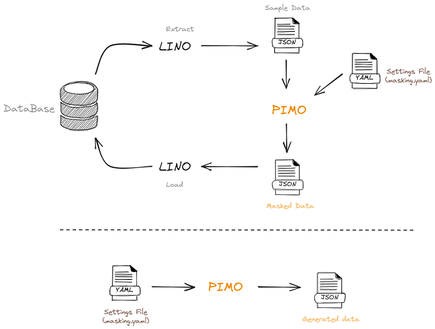
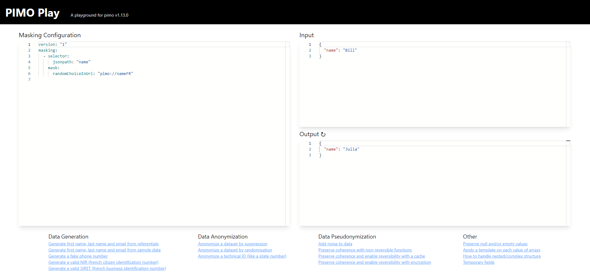

[](https://goreportcard.com/report/github.com/cgi-fr/pimo)


# PIMO : Private Input, Masked Output

PIMO is a tool for data masking. It can mask data from a JSONline stream and return another JSONline stream thanks to a masking configuration contained in a yaml file.



You can use [LINO](https://github.com/CGI-FR/LINO) to extract sample data from a database, which you can then use as input data for PIMO's data masking.
You can also generate data with a simple yaml configuration file.

**Capabilities**

- credibility : generated data is not distinguishable from real data
- data synthesis : generate data from nothing
- data masking, including
  - randomization : protect personal or sensitive data by writing over it
  - pseudonymization, on 3 levels
    - consistent pseudonymisation : real value A is always replaced by pseudo-value X but X can be attributed to other values than A
    - identifiant pseudonymisation : real value A is always replaced by pseudo-value X and X *CANNOT* be attributed to other values than A
    - reversible pseudonymisation : real value A can be generated from pseudo-value X

## Configuration file needed

PIMO requires a yaml configuration file to works. By default, the file is named `masking.yml` and is placed in the working directory. The file must respect the following format :

```yaml
version: "1"
seed: 42
functions:
    # Optional define functions
masking:
  - selector:
      jsonpath: "example.example"
    mask:
      type: "argument"
    # Optional cache (coherence preservation)
    cache: "cacheName"
    # Optional custom seed for this mask
    seed:
      field: "example.example"

  # another mask on a different location
  - selector:
      jsonpath: "example.example2"
    mask:
      type: "argument"
    preserve: "null"
    preserve-list: ["value to preserve"]

caches:
  cacheName:
    # Optional bijective cache (enable re-identification if the cache is dumped on disk)
    unique: true
    # Use reverse cache dictionnary
    reverse: true
```

`version` is the version of the masking file.
`seed` is to give every random mask the same seed, it is optional and if it is not defined, the seed is derived from the current time to increase randomness.
`functions` is used to define the functions that can be used in the te mask `template`, `template-each`, `add`, and `add-transient`.
`masking` is used to define the pipeline of masks that is going to be applied.
`selector` is made of a jsonpath and a mask.
`jsonpath` defines the path of the entry that has to be masked in the json file.
`mask` defines the mask that will be used for the entry defined by `selector`.
`cache` is optional, if the current entry is already in the cache as key the associated value is returned without executing the mask. Otherwise the mask is executed and a new entry is added in the cache with the orignal content as `key` and the masked result as `value`. The cache have to be declared in the `caches` section of the YAML file.
`preserve` is optional, and is used to keep some values unmasked in the json file. Allowed `preserve` options are: `"null"` (null values), `"empty"` (empty string `""`), and
`"blank"` (both `empty` and `null` values). Additionally, `preserve` can be used with mask [`fromCache`](#fromCache) to preserve uncached values. (usage: `preserve: "notInCache"`)
`preserve-list` is optional and is used to ignore specific values

Multiple masks can be applied on the same jsonpath location, like in this example :

```yaml
  - selector:
      jsonpath: "example"
    masks:
      - add: "hello"
      - template: "{{.example}} World!"
      - remove: true
```

Masks can be applied on multiple selectors, like in this example:

```yaml
  - selectors:
      - jsonpath: "example"
      - jsonpath: "example2"
    mask:
      add: "hello"
```

It is possible to define functions and reuse them later in the masks, like in this example:

```yaml
functions:
  add20:
    params:
      - name: "i"
    body: |-
      return i + 20
  sub:
    params:
      - name: "x"
      - name: "y"
    body: |-
      return x - y
masking:
  - selector:
      jsonpath: "addValue"
    mask:
      template: '{{add20 5}}'
  - selector:
      jsonpath: "subValue"
    mask:
      template: '{{sub 10 5}}'
```

## Possible masks

The following types of masks can be used :

* Pure randomization masks
  * [`regex`](#regex) is to mask using a regular expression given in argument.
  * [`randomInt`](#randomint) is to mask with a random int from a range with arguments min and max.
  * [`randomDecimal`](#randomdecimal) is to mask with a random decimal from a range with arguments min, max and precision.
  * [`randDate`](#randdate) is to mask a date with a random date between `dateMin` and `dateMax`.
  * [`randomDuration`](#randomduration) is to mask a date by adding or removing a random time between `Min` and `Max`.
  * [`randomChoice`](#randomchoice) is to mask with a random value from a list in argument.
  * [`weightedChoice`](#weightedchoice) is to mask with a random value from a list with probability, both given with the arguments `choice` and `weight`.
  * [`randomChoiceInUri`](#randomchoiceinuri) is to mask with a random value from an external resource.
  * [`randomChoiceInCSV`](#randomchoiceincsv) is to mask with a random value from an external CSV resource.
  * [`transcode`](#transcode) is to mask a value randomly with character class preservation.
  * [`timeline`](#timeline) to generate a set of dates related to each other (by rules and constraints)
* K-Anonymization
  * [`range`](#range) is to mask a integer value by a range of value (e.g. replace `5` by `[0,10]`).
  * [`duration`](#duration) is to mask a date by adding or removing a certain number of days.
* Re-identification and coherence preservation
  * [`hash`](#hash) is to mask with a value from a list by matching the original value, allowing to mask a value the same way every time.
  * [`hashInUri`](#hashinuri) is to mask with a value from an external resource, by matching the original value, allowing to mask a value the same way every time.
  * [`hashInCSV`](#hashincsv) is to mask with a value from an external CSV resource, by matching the original value, allowing to mask a value the same way every time.
  * [`fromCache`](#fromcache) is a mask to obtain a value from a cache.
  * [`ff1`](#ff1) mask allows the use of <abbr title="Format Preserving Encryption">FPE</abbr> which enable private-key based re-identification.
  * [`sha3`](#sha3) masks will apply a variable length cryptographic hash (SHAKE variable-output-length hash function defined by FIPS-202) and then apply a base-conversion to the output.
* Formatting
  * [`dateParser`](#dateparser) is to change a date format.
  * [`template`](#template) is to mask a data with a template using other values from the jsonline.
  * [`template-each`](#template-each) is like template but will apply on each value of an array.
  * [`fromjson`](#fromjson) is to convert string field values to parsed JSON, e.g. "[1,2,3]" -> [1,2,3].
* Data structure manipulation
  * [`remove`](#remove) is to mask a field by completely removing it.
  * [`add`](#add) is a mask to add a field to the jsonline.
  * [`add-transient`](#add-transient) same as `add` but the field is not exported in the output jsonline.
* Others
  * [`constant`](#constant) is to mask the value by a constant value given in argument.
  * [`command`](#command) is to mask with the output of a console command given in argument.
  * [`incremental`](#incremental) is to mask data with incremental value starting from `start` with a step of `increment`.
  * [`sequence`](#sequence) generate sequenced IDs of any format.
  * [`fluxUri`](#fluxuri) is to replace by a sequence of values defined in an external resource.
  * [`replacement`](#replacement) is to mask a data with another data from the jsonline.
  * [`pipe`](#pipe) is a mask to handle complex nested array structures, it can read an array as an object stream and process it with a sub-pipeline.
  * [`apply`](#apply) process selected data with a sub-pipeline.
  * [`partitions`](#partitions) will rely on conditions to identify specific cases.
  * [`segments`](#segments) allow transformations on specific parts of a field's value using regular expressions subgroups captures.
  * [`luhn`](#luhn) can generate valid numbers using the Luhn algorithm (e.g. french SIRET or SIREN).
  * [`markov`](#markov) can generate pseudo text based on a sample text.
  * [`findInCSV`](#findincsv) get one or multiple csv lines which matched with Json entry value from CSV files.
  * [`xml`](#xml) can manipulate XML content within JSON values.

A full `masking.yml` file example, using every kind of mask, is given with the source code.

In case two types of mask are entered with the same selector, the program can't extract the masking configuration and will return an error. The file `wrongMasking.yml` provided with the source illustrate that error.

## Usage

To use PIMO to mask a `data.json`, use in the following way :

```bash
./pimo <data.json >maskedData.json
```

This takes the `data.json` file, masks the data contained inside it and put the result in a `maskedData.json` file. If data are in a table (for example multiple names), then each field of this table will be masked using the given mask. The following flags can be used:

* `--repeat=N` This flag will make pimo mask every input N-times (useful for dataset generation).
* `--skip-line-on-error` This flag will totally skip a line if an error occurs masking a field.
* `--skip-field-on-error` This flag will return output without a field if an error occurs masking this field.
* `--skip-log-file <filename>` Skipped lines will be written to `<filename>`.
* `--catch-errors <filename>` or `-e <filename>` Equivalent to `--skip-line-on-error --skip-log-file <filename>`.
* `--empty-input` This flag will give PIMO a `{}` input, usable with `--repeat` flag.
* `--config=filename.yml` This flag allow to use another file for config than the default `masking.yml`.
* `--load-cache cacheName=filename.json` This flag load an initial cache content from a file (json line format `{"key":"a", "value":"b"}`).
* `--dump-cache cacheName=filename.json` This flag dump final cache content to a file (json line format `{"key":"a", "value":"b"}`).
* `--verbosity <level>` or `-v<level>` This flag increase verbosity on the stderr output, possible values: none (0), error (1), warn (2), info (3), debug (4), trace (5).
* `--debug` This flag complete the logs with debug information (source file, line number).
* `--log-json` Set this flag to produce JSON formatted logs ([demo9](demo/demo9) goes deeper into logging and structured logging)
* `--seed <int>` Set this flage to declare seed in command line.
* `--mask` Declare a simple masking definition in command line (minified YAML format: `--mask "value={fluxUri: 'pimo://nameFR'}"`, or `--mask "value=[{add: ''},{fluxUri: 'pimo://nameFR'}]"` for multiple masks). For advanced use case (e.g. if caches needed) `masking.yml` file definition will be preferred.
* `--repeat-until <condition>` This flag will make PIMO keep masking every input until the condition is met. Condition format is using [Template](https://pkg.go.dev/text/template). Last output verifies the condition.
* `--repeat-while <condition>` This flag will make PIMO keep masking every input while the condition is met. Condition format is using [Template](https://pkg.go.dev/text/template).
* `--stats <filename | url>` This flag either outputs run statistics to the specified file or send them to specified url (has to start with `http` or `https`).
* `--statsTemplate <string>` This flag will have PIMO use the value as a template to generate statistics. Please use go templating format to include statistics. To include them you have to specify them as `{{ .Stats }}`. (i.e. `{"software":"PIMO","stats":{{ .Stats }}}`)

### PIMO Play

The `play` command will start a local website, where you will find commented examples and a playground to play with the masking configuration.

```console
$ pimo play
⇨ http server started on [::]:3010
```

Then go to [http://localhost:3010/](http://localhost:3010/) in your browser.



## Examples

This section will give examples for every types of mask.

Please check the [demo folder](demo) for more advanced examples.

### Regex

[](https://cgi-fr.github.io/pimo-play/#c=G4UwTgzglg9gdgLgAQCICMKBQBbAhhAayjgHMFMkkBaJCEAGxAGMAXGMcyrpAKwngAOuFgAtkKASPggs3PIU7ckYECRAAPcQAYA2mioB2ALoAKJCZ1aqATiMBKAN4AmAL6OALC5RA&i=N4KABGBEAOAWD2A7AppAXFADARjJgTHgMx4AseArJCAL5A)

```yaml
  - selector:
      jsonpath: "phone"
    mask:
      regex: "0[1-7]( ([0-9]){2}){4}"
```

This example will mask the `phone` field of the input jsonlines with a random string respecting the regular expression.

[Return to list of masks](#possible-masks)

### Constant

[](https://cgi-fr.github.io/pimo-play/#c=G4UwTgzglg9gdgLgAQCICMKBQBbAhhAayjgHMFMkkBaJCEAGxAGMAXGMcyrpAKwngAOuFgAtkKOLmwgs3PIU7ckTeBBa44LcQCEo9eiiA&i=N4KABGBEB2CGC2BTSAuKApA9gC2pEAvkA)

```yaml
  - selector:
      jsonpath: "name"
    mask:
      constant: "Bill"
```

This example will mask the `name` field of the input jsonlines with the value of the `constant` field.

[Return to list of masks](#possible-masks)

### RandomChoice

[](https://cgi-fr.github.io/pimo-play/#c=G4UwTgzglg9gdgLgAQCICMKBQBbAhhAayjgHMFMkkBaJCEAGxAGMAXGMcyrpAKwngAOuFgAtkKOLmwgs3PIU7ckYXHAAmMbAGERMKExCKlNFAFl9BXA1lLqqU8JFQQAVxvH7uMAfqMUQA&i=N4KABGBEB2CGC2BTSAuKAhAlgG25EAvkA)

```yaml
  - selector:
      jsonpath: "name"
    mask:
      randomChoice:
       - "Mickael"
       - "Mathieu"
       - "Marcelle"
```

This example will mask the `name` field of the input jsonlines with random values from the `randomChoice` list.

[Return to list of masks](#possible-masks)

### RandomChoiceInUri

[](https://cgi-fr.github.io/pimo-play/#c=G4UwTgzglg9gdgLgAQCICMKBQBbAhhAayjgHMFMkkBaJCEAGxAGMAXGMcyrpAKwngAOuFgAtkKOLmwgs3PIU7ckYXHAAmMbAGERMKExABJOAFUwUcQKjYYCAPR3J0gKIA5FEA&i=N4KABGBEB2CGC2BTSAuKAhAlgG25EAvkA)

```yaml
  - selector:
      jsonpath: "name"
    mask:
      randomChoiceInUri: "file://names.txt"
```

This example will mask the `name` field of the input jsonlines with random values from the list contained in the name.txt file. The different URI usable with this selector are : `pimo`, `file` and `http`/`https`.

A value can be injected in URI with the template syntax. For example, `file://name{{.gender}}.txt` select a line in `name_F.txt` if the current jsonline is `{gender : "F"}`.

[Return to list of masks](#possible-masks)

### RandomChoiceInCSV

[](https://cgi-fr.github.io/pimo-play/#c=G4UwTgzglg9gdgLgAQCICMKBQBbAhhAayjgHMFMkkBaJCEAGxAGMAXGMcyrpAKwngAOuFgAtkKATAIhs8LNzyFO3JGFxwAJjGwBhETChMQASTg6AygDVlKpAFcwUcSJYsBEBAHpPJKBBYAdL6idgBGdnRgTPAsIHCB0dieuGDYvvSMEJ5oAJwALKFMAGZFAMwArAAMlWggAOwgoeWluABMuAAcoXl5tV2tTABsnmoA7p45ra3VhZW4g3WlGuVGrWhoc7i4GnnlPSAag0x5NZVFgx11npLSsnABTBDA8rZIIiDb4MgsYHYgmEA&i=N4KABGBEAOD2DWBTAtrAdpAXGNBXANviAL5A)

```yaml
version: "1"
masking:
  - selector:
      jsonpath: "pokemon"
    mask:
      randomChoiceInCSV:
        uri: "https://gist.githubusercontent.com/armgilles/194bcff35001e7eb53a2a8b441e8b2c6/raw/92200bc0a673d5ce2110aaad4544ed6c4010f687/pokemon.csv"
        header: true          # optional: csv has a header line, use it to name fields, default: false
        separator: ","        # optional: csv value separator is , (default value)
        comment: "#"          # optional: csv contains comments starting with #, if empty no comment is expected (default)
        fieldsPerRecord: 0    # optional: number of fields per record, if 0 sets it to the number of fields in the first record (default)
                              # if negative, no check is made and records may have a variable number of fields
        trim: true            # optional: trim space in values and headers, default: false
```

The selected field's data will be masked with random values selected from a CSV file available at the specified URL (a GitHub gist in this case).

Here is a detailed breakdown of the example configuration:

* selector: The jsonpath: "pokemon" line means that this masking configuration is meant to apply to the field named "pokemon" in the JSON data.
* mask: This defines the masking operation to be performed on the "pokemon" field.
* randomChoiceInCSV: The mask will replace the value in the "pokemon" field with a random choice from the CSV file at the specified URL.
* uri: The location of the CSV file to use for replacement values, `file` and `http`/`https` schemes can be used. This parameter can be a template.
* header: This optional parameter is set to true, meaning the CSV file contains a header line that names the fields.
* separator: This optional parameter specifies that the CSV values are separated by a comma, which is the default separator in CSV files.
* comment: This optional parameter specifies that the CSV file may contain comments that start with a '#'.
* fieldsPerRecord: This optional parameter is set to 0, meaning the number of fields per record will be set to the number of fields in the first record by default. If negative, no check is made and records may have a variable number of fields.
* trim: This optional parameter is set to true, meaning any spaces in values and headers in the CSV file will be trimmed.

[Return to list of masks](#possible-masks)

### RandomInt

[](https://cgi-fr.github.io/pimo-play/#c=G4UwTgzglg9gdgLgAQCICMKBQBbAhhAayjgHMFMkkBaJCEAGxAGMAXGMcyrpAKwngAOuFgAtkKXCRBZueQp25IwuOABMY2AJJwWCxUmzFkAJgCsFfQdwAPZAGZjQA&i=N4KABGBECGDmCmkBcYAsAGEBfIA)

```yaml
  - selector:
      jsonpath: "age"
    mask:
      randomInt:
        min: 25
        max: 32
```

This example will mask the `age` field of the input jsonlines with a random number between `min` and `max` included.

[Return to list of masks](#possible-masks)

### RandomDecimal

[](https://cgi-fr.github.io/pimo-play/#c=G4UwTgzglg9gdgLgAQCICMKBQBbAhhAayjgHMFMkkBaJCEAGxAGMAXGMcyrpAKwngAOuFgAtkKCE3Ygs3PIU7ckYXHAAmMbABFmUPPUVKk2YsgAMFI8dwAPZGgDsAOgBMAZktGBYXdHjIXIA&i=N4KABGBEDODGD2AnAppAXGADAOkyAvkA)

```yaml
  - selector:
      jsonpath: "score"
    mask:
      randomDecimal:
        min: 0
        max: 17.23
        precision: 2
```

This example will mask the `score` field of the input jsonlines with a random float between `min` and `max`, with the number of decimal chosen in the `precision` field.

[Return to list of masks](#possible-masks)

### Command

```yaml
  - selector:
      jsonpath: "name"
    mask:
      command: "echo -n Dorothy"
```

This example will mask the `name` field of the input jsonlines with the output of the given command. In this case, `Dorothy`.

[Return to list of masks](#possible-masks)

### WeightedChoice

[](https://cgi-fr.github.io/pimo-play/#c=G4UwTgzglg9gdgLgAQCICMKBQBbAhhAayjgHMFMkkBaJCEAGxAGMAXGMcyrpAKwngAOuFgAtkKCAFcwcXNhBZueQp25IA7iCgkRLEABMAwiJhQmIVWupImJsxdQARSQPgtFVrpu27kATgpPGltTc3FnVzh9D08NLR0WZDQgA&i=N4KABGBEDOCuBOA7AhgWwKaQFxQBLIBMCB7AYwGtIQBfIA)

```yaml
  - selector:
      jsonpath: "surname"
    mask:
      weightedChoice:
        - choice: "Dupont"
          weight: 9
        - choice: "Dupond"
          weight: 1
```

This example will mask the `surname` field of the input jsonlines with a random value in the `weightedChoice` list with a probability proportional at the `weight` field.

[Return to list of masks](#possible-masks)

### Hash

[](https://cgi-fr.github.io/pimo-play/#c=G4UwTgzglg9gdgLgAQCICMKBQBbAhhAayjgHMFMkkBaJCEAGxAGMAXGMcyrpAKwngAOuFgAtkKNgHc4WbnkKduSEfjEUllGigCi2cLnoATJAGEoLAJ6yN1VACUArgCMLp81fUatAZVwCBIlBgIG6WKEA&i=N4KABGBEAuD2DuA7SAuKAFAhgJwJYGdIQBfIA)

```yaml
  - selector:
      jsonpath: "town"
    mask:
      hash:
        - "Emerald City"
        - "Ruby City"
        - "Sapphire City"
```

This example will mask the `town` field of the input jsonlines with a value from the `hash` list. The value will be chosen thanks to a hashing of the original value, allowing the output to be always the same in case of identical inputs.

[Return to list of masks](#possible-masks)

### HashInUri

[](https://cgi-fr.github.io/pimo-play/#c=G4UwTgzglg9gdgLgAQCICMKBQBbAhhAayjgHMFMkkBaJCEAGxAGMAXGMcyrpAKwngAOuFgAtkKOLmwgs3PIU7ckI-CICScAKpgo4gVGwwEAemOTpAMQBKKIA&i=N4KABGBEB2CGC2BTSAuKAhAlgG25EAvkA)

```yaml
  - selector:
      jsonpath: "name"
    mask:
      hashInUri: "pimo://nameFR"
```

This example will mask the `name` field of the input jsonlines with a value from the list nameFR contained in pimo, the same way as for `hash` mask. The different URI usable with this selector are : `pimo`, `file` and `http`/`https`.

[Return to list of masks](#possible-masks)

### HashInCSV

[](https://cgi-fr.github.io/pimo-play/#c=G4UwTgzglg9gdgLgAQCICMKBQBbAhhAayjgHMFMkkBaJCEAGxAGMAXGMcyrpAKwngAOuFgAtkKATAIhs8LNzyFO3JCPwiAknADCAZQBqylUgCuYKOJEsWAiAgD09klAgsAdM9EmARibpgmeBYQOHdA7HtcMGxnekYIezQATgAWbyYAMwyAZgBWAAZ8tBAAdhBvXOzcACZcAA5vFJTihuqmADZ7MFwAd3sk6urC9PzcdpLsgBNcphBqtDRR3FxJlNymkEn2phSi-Iz2upL7SWlZODcmCGB5Y1UQFfBkFjATEDuuAGIkGAEWWDguHoyCuwFU+CQuHujzASHoxBAmCAA&i=N4KABGBEAOD2DWBTAtrAdpAXFAgpEAvkA)

```yaml
version: "1"
masking:
  - selector:
      jsonpath: "pokemon"
    mask:
      hashInCSV:
        uri: "https://gist.githubusercontent.com/armgilles/194bcff35001e7eb53a2a8b441e8b2c6/raw/92200bc0a673d5ce2110aaad4544ed6c4010f687/pokemon.csv"
        header: true          # optional: csv has a header line, use it to name fields, default: false
        separator: ","        # optional: csv value separator is , (default value)
        comment: "#"          # optional: csv contains comments starting with #, if empty no comment is expected (default)
        fieldsPerRecord: 0    # optional: number of fields per record, if 0 sets it to the number of fields in the first record (default)
                              # if negative, no check is made and records may have a variable number of fields
        trim: true            # optional: trim space in values and headers, default: false
```

The selected field's data will be masked with random values selected from a CSV file available at the specified URL (a GitHub gist in this case). The value will be chosen thanks to a hashing of the original value, allowing the output to be always the same in case of identical inputs.

See [RandomChoiceInCSV](#randomchoiceincsv) for a detailed breakdown of the example configuration.

[Return to list of masks](#possible-masks)

### RandDate

[](https://cgi-fr.github.io/pimo-play/#c=G4UwTgzglg9gdgLgAQCICMKBQBbAhhAayjgHMFMkkBaJCEAGxAGMAXGMcyrpAKwngAOuFgAtkKACbCQWbnkKduSMLjgSAItMVKkUliACyxcWgCcAdgAMVS2htoAKpcsJnrywC1ZO3dIO4AD3EAJktQ+3snFzdnLyA&i=N4KABGBEAmCGAuBTSAuKkQF8g)

```yaml
  - selector:
      jsonpath: "date"
    mask:
      randDate:
        dateMin: "1970-01-01T00:00:00Z"
        dateMax: "2020-01-01T00:00:00Z"
```

This example will mask the `date` field of the input jsonlines with a random date between `dateMin` and `dateMax`. In this case the date will be between the 1st January 1970 and the 1st January 2020.

[Return to list of masks](#possible-masks)

### Duration

[](https://cgi-fr.github.io/pimo-play/#c=G4UwTgzglg9gdgLgAQCICMKBQBbAhhAayjgHMFMkkBaJCEAGxAGMAXGMcyrpAKwngAOuFgAtkKevhYB9JvBa5WWbnkKduSACYBXMMNiJUVAAoAmACIogA&i=N4KABGBEA2CGDOAXA+gYwPYDtG1YyAXFAEwAMZAtKQIxXUAqppBTLpAWpCAL5A)

```yaml
  - selector:
      jsonpath: "last_contact"
    mask:
      duration: "-P2D"
```

This example will mask the `last_contact` field of the input jsonlines by decreasing its value by 2 days. The duration field should match the ISO 8601 standard for durations.

[Return to list of masks](#possible-masks)

### DateParser

[](https://cgi-fr.github.io/pimo-play/#c=G4UwTgzglg9gdgLgAQCICMKBQBbAhhAayjgHMFMkkBaJCEAGxAGMAXGMcyrpAKwngAOuFgAtkKACbCQWbnkKduSKSxAAFXJHCKlSYgICuLAGLs8LcQCYADNYBsVa2keXZupDCOGTZ4eKcA9NaWQXYoQA&i=N4KABGBEAmCGAuBTSAuKAmADOgzAWkwDYCBWSEAXyA)

```yaml
  - selector:
      jsonpath: "date"
    mask:
      dateParser:
        inputFormat: "2006-01-02"
        outputFormat: "01/02/06"
```

This example will change every date from the date field from the `inputFormat` to the `outputFormat`. The format should always display the following date : `Mon Jan 2 15:04:05 -0700 MST 2006`. Either field is optional and in case a field is not defined, the default format is RFC3339, which is the base format for PIMO, needed for `duration` mask and given by `randDate` mask. It is possible to use the Unix time format by specifying `inputFormat: "unixEpoch"` or `outputFormat: "unixEpoch"`.

[Return to list of masks](#possible-masks)

### RandomDuration

[](https://cgi-fr.github.io/pimo-play/#c=G4UwTgzglg9gdgLgAQCICMKBQBbAhhAayjgHMFMkkBaJCEAGxAGMAXGMcyrpAKwngAOuFgAtkKACbCQWbnkKduSMLjgSY2ACIBXFS1iIKSytmLiqABQBMm2caR4AHuesB2W0A&i=N4KABGBEAmCGAuBTSAuKAmADFgtJgjHvgCqaYpkWYBakIAvkA)

```yaml
  - selector:
      jsonpath: "date"
    mask:
      randomDuration:
        min: "-P2D"
        max: "-P27D"
```

This example will mask the `date` field of the input jsonlines by decreasing its value by a random value between 2 and 27 days. The durations should match the ISO 8601 standard.

[Return to list of masks](#possible-masks)

### Incremental

[](https://cgi-fr.github.io/pimo-play/#c=G4UwTgzglg9gdgLgAQCICMKBQBbAhhAayjgHMFMkkBaJCEAGxAGMAXGMcyrpAKwngAOuFgAtkKKABMs3PIU7ckxJmBDYQcFrnoLFtLWBbI0FPUrgq1Go0jRA&i=N4KABGBECWAmkC4wAYQF8g)

```yaml
  - selector:
      jsonpath: "id"
    mask:
      incremental:
        start: 1
        increment: 1
```

This example will mask the `id` field of the input jsonlines with incremental values. The first jsonline's `id` will be masked by 1, the second's by 2, etc...

[Return to list of masks](#possible-masks)

### Sequence

[](https://cgi-fr.github.io/pimo-play/#c=G4UwTgzglg9gdgLgAQCICMKBQBbAhhAayjgHMFMkkBaJCEAGxAGMAXGMcyrpAKwngAOuFgAtkKKABMs3PIU7daIAI4BXEHCYgFipADN2eFuICiAJTNUADDatYgA&i=N4KABGBECWAmkC4wDsCuAbdIC+Q)

```yaml
  - selector:
      jsonpath: "id"
    mask:
      sequence:
        format: "ERR-0000"
```

This example will generate the `id` field of the input jsonlines with sequenced values. The first jsonline's `id` will be masked by `ERR-0000`, the second's by `ERR-0001`, etc...

By default, the varying part of the ID is numbers, but this can be changed :

```yaml
  - selector:
      jsonpath: "id"
    mask:
      sequence:
        format: "ERR-0000"
        varying: "ER"
```

With this configuration, the first jsonline's `id` will be masked by `EEE-0000`, the second's by `EER-0000`, the third by `ERE-0000` etc...

[Return to list of masks](#possible-masks)

### Replacement

[](https://cgi-fr.github.io/pimo-play/#c=G4UwTgzglg9gdgLgAQCICMKBQBbAhhAayjgHMFMkkBaJCEAGxAGMAXGMcyrpAKwngAOuFgAtkKOLmwgALFm55CnbkjAgB9XExDS4LcZOkogA&i=N4KABGBEB2CGC2BTSAuKBBaATATgS8gBpwo4kAWVKAKQHs4AXAC1mkhAF8g)

```yaml
  - selector:
      jsonpath: "name4"
    mask:
      replacement: "name"
```

This example will mask the `name4` field of the input jsonlines with the field `name` of the jsonline. This selector must be placed after the `name` selector to be masked with the new value and it must be placed before the `name` selector to be masked by the previous value.

[Return to list of masks](#possible-masks)

### Template

[](https://cgi-fr.github.io/pimo-play/#c=G4UwTgzglg9gdgLgAQCICMKBQBbAhhAayjgHMFMkkBaJCEAGxAGMAXGMcyrpAKwngAOuFgAtkKPFHpZueQp25IWIbAPrCQ4gN5aAdBACuYOLmwgkAHyQA5GAEEmTEHBaWk9GAHdwAXx+6dXRMzN1sHJxc3D28wPwABEkl6XSYYbBQgA&i=N4KABGBEDOCuBOA7AhgWwKaQFxQIKIBN4BLyAGnChQ2ygCkB7FAFwAtlFzLJVkBLADa1EsAQJABfIA)

```yaml
  - selector:
      jsonpath: "mail"
    mask:
      template: "{{.surname}}.{{.name}}@gmail.com"
```

This example will mask the `mail` field of the input jsonlines respecting the given template. In the `masking.yml` config file, this selector must be placed after the fields contained in the template to mask with the new values and before the other fields to be masked with the old values. In the case of a nested json, the template must respect the following example :

```yaml
  - selector:
      jsonpath: "user.mail"
    mask:
      template: "{{.user.surname}}.{{.user.name}}@gmail.com"
```

The format for the template should respect the `text/template` package : <https://golang.org/pkg/text/template/>

The template mask can format the fields used. The following example will create a mail address without accent or upper case:

```yaml
  - selector:
      jsonpath: "user.mail"
    mask:
      template: "{{.surname | NoAccent | upper}}.{{.name | NoAccent | lower}}@gmail.com"
```

Available functions for templates come from <http://masterminds.github.io/sprig/>.

Most masks will be available as functions in template in the form : MaskCapitalizedMaskName.

```yaml
  - selector:
      jsonpath: "mail"
    masks:
      - add: ""
      - template: '{{MaskRegex "[a-z]{10}"}}.{{MaskRegex "[a-z]{10}"}}.{{MaskRandomInt 0 100}}@gmail.com'
```

[Return to list of masks](#possible-masks)

### Template each

[](https://cgi-fr.github.io/pimo-play/#c=G4UwTgzglg9gdgLgAQCICMKBQBbAhhAayjgHMFMkkBaJCEAGxAGMAXGMcyrpAKwngAOuFgAtkKXGDC4Anlm55CnbkhYhsA+sJBUQuJmIorKajVrXiA3pZZQWjJADpguegFcQAX0-zjSO+riLu4gKEA&i=N4KABGBECGBOvQJ6QFxgNqQG7QDYFcBTARkgBoocDCAmSAXRAF8g)

```yaml
  - selector:
      jsonpath: "array"
    mask:
      template-each:
        template: "{{title .value}}"
        item: "value"
```

This will affect every values in the array field. The field must be an array (`{"array": ["value1", "value2"]}`).
The `item` property is optional and defines the name of the current item in the templating string (defaults to "it"). There is another optional property `index`, if defined then a property with the given name will be available in the templating string (e.g. : `index: "idx"` can be used in template with `{{.idx}}`).

The format for the template should respect the `text/template` package : <https://golang.org/pkg/text/template/>

See also the [Template mask](#template) for other options, all functions are applicable on template-each.

[Return to list of masks](#possible-masks)

### Fromjson

[](https://cgi-fr.github.io/pimo-play/#c=G4UwTgzglg9gdgLgAQCICMKBQBbAhhAayjgHMFMkkBaJCEAGxAGMAXGMcyrpAKwngAOuFgAtkKFrjAkQLAGZQGAEyzc8hTtyRywMbH3jj+AVzBMQC5SiA&i=N4KABGBEDOD2CuAnAxgUwGYEtUBsAmkAXFMADqQBWcAducQIwC+kANOFAC4CGiA5qhyy4CxavBw4QjIA)

```yaml
  - selector:
      jsonpath: "targetfield"
    mask:
      fromjson: "sourcefield"
```

This example will mask the `targetfield` field of the input jsonlines with the parsed JSON from field `sourcefield` of the jsonline. This mask changes the type of the input string (`sourcefield`) :

* null : nil
* string: string
* number: float64
* array:  slice
* object: map
* bool: bool

[Return to list of masks](#possible-masks)

### Remove

[](https://cgi-fr.github.io/pimo-play/#c=G4UwTgzglg9gdgLgAQCICMKBQBbAhhAayjgHMFMkkBaJCEAGxAGMAXGMcyrpAKwngAOuFgAtkKAK51GECFQBmUBgBMs3PIU7ckYENhihkLMBJBA&i=N4KABGBECuDOCmAbetYFoBmBLJATSAXFABZKID2kIAvkA)

```yaml
  - selector:
      jsonpath: "useless-field"
    mask:
      remove: true
```

This field will mask the `useless-field` of the input jsonlines by completely deleting it.

[Return to list of masks](#possible-masks)

### Add

[](https://cgi-fr.github.io/pimo-play/#c=G4UwTgzglg9gdgLgAQCICMKBQBbAhhAayjgHMFMkkBaJCEAGxAGMAXGMcyrpAKwngAOuFgAtkKOCADuAMSgMAJlm55CnbklwKF4yVOC56AVxAogA&i=N4XyA)

```yaml
  - selector:
      jsonpath: "newField"
    mask:
      add: "newvalue"
```

This example will create the field `newField` containing the value `newvalue`. This value can be a string, a number, a boolean...

The field will be created in every input jsonline that doesn't already contains this field.

Note: add can contains template strings (see the [Template](#template) mask for more information).

[Return to list of masks](#possible-masks)

### Add-Transient

[](https://cgi-fr.github.io/pimo-play/#c=G4UwTgzglg9gdgLgAQCICMKBQEQgCbIAsATJgLYCGEA1lHAOYKaZJIC0SOANiAMYAuMME1aikAKwjwADhX4ALZCn5gKcaCDj8A+gDMoILnixjKNEWKQU8eNirUatSgN7PVcPAEEu0+RQByAK5kSADMAL7hWCzsnIZ8gsIxYpIycoqo+obGyUhm1BZi1gSoACryIEjyUDaaSMAUXIGVUBBIyK4AdPbqBlp6BkaRWEA&i=N4XyA)

```yaml
  - selector:
      jsonpath: "newField"
    mask:
      add-transient: "newvalue"
```

This example will create the field `newField` containing the value `newvalue`. This value can be a string, a number, a boolean... It can also be a [template](#template).

The field will be created in every input jsonline that doesn't already contains this field, and it will be removed from the final JSONLine output.

This mask is used for temporary field that is only available to other fields during the execution.

Note: add-transient can contains template strings (see the [Template](#template) mask for more information).

[Return to list of masks](#possible-masks)

### FluxURI

[](https://cgi-fr.github.io/pimo-play/#c=G4UwTgzglg9gdgLgAQCICMKBQBbAhhAayjgHMFMkkBaJCEAGxAGMAXGMcyrpAKwngAOuFgAtkKATAIhs8CADoAJsNxZueQp25IAZvQCuADwCqYKOJEsWAiAgD0dklAgt5T0foBG+umCbwWEDhXf2w7XDBsJ3pGCDs0AE4AFk8mHR0AZgBWAAYctBAAdhBPLIzcACZcAA5PJKSC2oqmADY7MFwAdzsEioq81JzcFsKMxSymEAq0NCHcXEUkrPqQRRamJPycnRbqwrtJaVk4eSYIYCwgA&i=N4WAUABBBEAOD2BrApgW3gOwM7QFwQG1wophoATAQwBdK8IMBXAG2YF8AaYksq2+pq07dSFGnXyD2XSDzH9JLaSIi9xApW24BdcGyA)

```yaml
  - selector:
      jsonpath: "id"
    mask:
      fluxURI: "file://id.csv"
```

This example will create an `id` field in every output jsonline. The values will be the ones contained in the `id.csv` file in the same order as in the file. If the field already exist on the input jsonline it will be replaced and if every value of the file has already been assigned, the input jsonlines won't be modified.

[Return to list of masks](#possible-masks)

### FromCache

```yaml
  - selector:
      jsonpath: "id"
    mask:
      fromCache: "fakeId"
  caches:
    fakeId :
      unique: true
      reverse: false
```

This example will replace the content of `id` field by the matching content in the cache `fakeId`. Cache have to be declared in the `caches` section.
Cache content can be loaded from jsonfile with the `--load-cache fakeId=fakeId.jsonl` option or by the `cache` option on another field.
If no matching is found in the cache, `fromCache` block the current line and the next lines are processing until a matching content go into the cache.
A `reverse` option is available in the `caches` section to use the reverse cache dictionary.

[Return to list of masks](#possible-masks)

### FF1

[](https://cgi-fr.github.io/pimo-play/#c=G4UwTgzglg9gdgLgAQCICMKBQBbAhhAayjgHMFNMkkBaJCEAGxAGMAXGMcq7pAKwngAHXKwAWyFFAAmIOKygAzKOCw88hLjyQKFaTVqQEQATwBiYGNgCicYBNOm0AfSsA5AMIAlAJoAFACoAkgDyrk4A0lbeqgZIUpa4xBIADGgATADMACwArABsAOwAHACcKEgAxEi4DAxIgjAQ0ABGTEjMorhguGzgEEjE1XRQYCCslLGCo-RgoMisYACuIJUDCkgLywA07Z2QSDCLrNAyB+tiK-F4gwDuULVIzStTIDOgUgNwB0eCRxMG8CsYAsnCQAHJArYatIkMAasskABvRFIAB00lk8iU4CQAF9cWDVoo6GMdmIoP1WCBsIIGCIVncHk8kCAAB4sI4gD7wFnAjgUKhVfwwOIsMDGQSsIZwhgIxb0UXMcWS+ZLEATWj0JhsDj6bj8IQicSoDFyRTKMBOGRKiVUqQxKjqAgQPVUWi4KRSCTI9EyM3YsD4h3cWg6PT-WJGMwWay2eyOFweHwBEJhSLRCMGK6JRCoVKZXKFUrBgwvN4gVXLTNaQF80EQqEMGEyhHItGmrEWvEE6s8a3K1iV9VAA&i=N4KABGBECWAmCmA7ALtAZteAnSAuKAHAEwDMBBAnAGwC0ALKSQKx2UWQgC+QA)

```yaml
  - selector:
      jsonpath: "siret"
    mask:
      ff1:
        keyFromEnv: "FF1_ENCRYPTION_KEY"
        domain: "0123456789" # all possible characters in a siret
        onError: "Invalid value = {{ .siret }}" # if set, this template will be executed on error
```

This example will encrypt the `siret` column with the private key base64-encoded in the FF1_ENCRYPTION_KEY environment variable. Use the same mask with the option `decrypt: true` to re-identify the unmasked value.

Characters outside of the domain can be preserved with `preserve: true` option.

Be sure to check [the full FPE demo](demo/demo7) to get more details about this mask.

[Return to list of masks](#possible-masks)

### Sha3

[](https://cgi-fr.github.io/pimo-play/#c=G4UwTgzglg9gdgLgAQCICMKBQEQgCbJoBMAzJgLYCGEA1lHAOYKZJIC0SOANiAMYAuMMM1aikAKwjwADpX4ALZChBUoXLGKq0RYzvMokdupD0YLCRJAGIk+iPKSCkAOSQAjAJ78QEADRJeGC4uKGh4JDAfUP5KOF4QJFCkIgA9AApnACoAFgBKFmMkPBhVRFQABmISbIBWADYAdgAOAE4UawD4UDB+Rxh3agS0cqQAdygFIqgGCYgkcrYWzCA&i=N4KABGBECmC2CGBLANpAXFAdvW0B0AzgK4BO2uAAgCYD2CimeAxnZCAL5A)

The sha3 mask will apply a variable length cryptographic hash (SHAKE variable-output-length hash function defined by FIPS-202) and then apply a base-conversion to the output.

This is useful to mask any input data into a coherent and collision resistant ID.

```yaml
version: "1"
seed: 123 # needed to salt the hash (can also be set via command line argument --seed 123)
masking:
  - selector:
      jsonpath: "email"
    mask:
      sha3:
        length: 12 # hash to N bytes, collision resistance is 2^(N*4)
        domain: "0123456789" # convert to base 10 with digits 0-9
```

In this example, the email will be replaced with a 29-digit collision resistant number. The collision resistance will be considered very good if the number of ID generated is less than `2^(12*8/2)`.

An alternative configuration to the previous example is :

```yaml
version: "1"
seed: 123 # needed to salt the hash (can also be set via command line argument --seed 123)
masking:
  - selector:
      jsonpath: "email"
    mask:
      sha3:
        resistance: 10000000 # set the collision resistance to 10M, so the required length for the id will be calculated to have a minimum collision-resistance value of 10M
        domain: "0123456789" # convert to base 10 with digits 0-9
```

Here the length parameter is not given, but with the `resistance` parameter set to 10M, the mask will calculate the minimum length required (6 bytes in this example because 2^(6*8/2) > 10M).

It can be difficult to anticipate what will be the maximum identifier string length (in characters) because it depends to the `domain` and the value of the `length` parameter (which can be invisible in the masking configuration because it is deduced from the `resistance` parameter). Therefore an optional parameter named `maxstrlen` was created, it's only purpose is to inform with an error if the maximum length (in characters) of identifier that can be produced is greater than a threshold.

[Return to list of masks](#possible-masks)

### Range

[](https://cgi-fr.github.io/pimo-play/#c=G4UwTgzglg9gdgLgAQCICMKBQBbAhhAayjgHMFMkkBaJCEAGxAGMAXGMcyrpAKwngAOuFgAtkKXCRBZueQp25IwuUiGQBWIA&i=N4KABGBECGDmCmkBcUDskQF8g)

```yaml
  - selector:
      jsonpath: "age"
    mask:
      range: 5
```

This mask will replace an integer value `{"age": 27}` with a range like this `{"age": "[25;29]"}`.

[Return to list of masks](#possible-masks)

### Pipe

[](https://cgi-fr.github.io/pimo-play/#c=G4UwTgzglg9gdgLgAQCICMKBQEQgCbIAsATJgLYCGEA1lHAOYKZJIC0SOANiAMYAuMMExYikAYiR8AFlAhIADhWkKYdPnIFIKcLWDAUAnkhgAzBeAjwIzUUgBWluIunIUg+tqgAvJbDgQAOnkLKyxRShphWwkoPiQAdyhOTiQAIxAFKGC8SRhJKQyI2gZM4M46DLwQEzpYvzSQThh4m1F5LJAo23F8jMUwEDg4mFS7XjiACgokPBhKOgBKBKSU9K0eHhAIaFTuZeVpDJQAfRQkYAowKApdjLgKMhBW2zox-gAFS8G+V1Pn8KoxUY-1s7C440EXW6tgc8GcUlc90eYWhAMiINREhqjTwcjo0CqvXMkHgxlG4yQPG0DXWm22+BmUAG-E4Bgx0L4IDI8k4Sk6qAA3gLJLE9gEkRkAL6SlGosGNCFCdndWFOJQI1AQACuYAlstRSCKUINki5PL5riFIr4Yu1uoeUplyrYHAV-EhztEqvhri5FCS+tRRs9Igkh3OFE4WoyEAEAxy+KghPD-W+ZLecVktK2Oz20jAMC19CkqFO+W01A0eRTXyGSFe4z8IZYnO5vM5luFTXi4CQ4odSGlASt3d7ATtEsHkoAAlaAscArN5jppVggA&i=N4KABGBED2BODmBDAdgSwF6IC6usgzpAFxgDa4EYollkAJtALaKrLFQDGTADigJ4A6Lo0gAaCjUjcAprHx5CJcjRrUVk5IkbT2kADbS8iMRPVR8AV1ibtuxqj0HYJs7WnMHuyKZoBfca5qrpA2OiSQAFbQOgGu5lahunSIAG6ohLHB7ix6Xj6UvvkAuqb+pkG0DB5s4cK8yIIAZs6ZtDJyCuzKZhXqIVphUIh6LGytfZbWA3ayHKiyLnGQ2Z7h3q5lgfka0+GNenCoKIvBk4nhBvCwKHQnZsseuWvbYIXqJX4UJb5AA)

If the data structure contains arrays of object like in the example below, this mask can pipe the objects into a sub pipeline definition.

**`data.jsonl`**

```json
{
    "organizations": [
        {
            "domain": "company.com",
            "persons": [
                {
                    "name": "leona",
                    "surname": "miller",
                    "email": ""
                },
                {
                    "name": "joe",
                    "surname": "davis",
                    "email": ""
                }
            ]
        },
        {
            "domain": "company.fr",
            "persons": [
                {
                    "name": "alain",
                    "surname": "mercier",
                    "email": ""
                },
                {
                    "name": "florian",
                    "surname": "legrand",
                    "email": ""
                }
            ]
        }
    ]
}
```

**`masking.yml`**

```yaml
version: "1"
seed: 42
masking:
  - selector:
      # this path points to an array of persons
      jsonpath: "organizations.persons"
    mask:
      # it will be piped to the masking pipeline definition below
      pipe:
        # the parent object (a domain) will be accessible with the "_" variable name
        injectParent: "_"
        masking:
          - selector:
              jsonpath: "name"
            mask:
              # fields inside the person object can be accessed directly
              template: "{{ title .name }}"
          - selector:
              jsonpath: "surname"
            mask:
              template: "{{ title .surname }}"
          - selector:
              jsonpath: "email"
            mask:
              # the value stored inside the parent object is accessible through "_" thanks to the parent injection
              template: "{{ lower .name }}.{{ lower .surname }}@{{ ._.domain }}"
```

In addition to the `injectParent` property, this mask also provide the `injectRoot` property to inject the whole structure of data.

It is possible to simplify the `masking.yml` file by referencing an external yaml definition :

```yaml
version: "1"
seed: 42
masking:
  - selector:
      jsonpath: "organizations.persons"
    mask:
      pipe:
        injectParent: "domain"
        file: "./masking-person.yml"
```

Be sure to check [demo](demo/demo8) to get more details about this mask.

[Return to list of masks](#possible-masks)

### Apply

[](https://cgi-fr.github.io/pimo-play/#c=G4UwTgzglg9gdgLgAQCICMKBQBbAhhAayjgHMFMkkBaJCEAGxAGMAXGMcyrpAKwngAOuFgAtkKKACNccLNzyFO3JLgED6ATyXKkAVzBRxAOgD09KWFxgNJhUVJUpMoxuz0sQA&i=N4KABGBECWBGCGA7SAuKkQF8g)

This mask helps you organize your masking configuration in different files, enablig reuse and mutualisation of masks.

```yaml
version: "1"
masking:
  - selector:
      jsonpath: "iban"
    mask:
      apply:
        uri: "./library/masking-iban.yml" # list of mask to apply on iban is declared in an external masking file
```

[Return to list of masks](#possible-masks)

### Luhn

[](https://cgi-fr.github.io/pimo-play/#c=G4UwTgzglg9gdgLgAQCICMKBQEQgCbIAsATJgLYCGEA1lHAOYKZJIC0SOANiAMYAuMMExYikAKwjwADhT4ALZCmhgQfLKMo1hopJwCucxEgDeAXyA&i=N4KABGBEDOCWBOBTALpAXFAjAJgMwBYBWANgHYAOATgAYddIQBfIA)

The [Luhn](https://en.wikipedia.org/wiki/Luhn_algorithm) algorithm is a simple checksum formula used to validate a variety of identification numbers.

The `luhn` mask can calculate the checksum for any value.

```yaml
  - selector:
      jsonpath: "siret"
    mask:
      luhn: {}
```

In this example, the `siret` value will be appended with the correct checksum, to create a valid SIRET number (french business identifier).

The mask can be parametered to use a different universe of valid characters, internally using the [Luhn mod N](https://en.wikipedia.org/wiki/Luhn_mod_N_algorithm) algorithm.

```yaml
  - selector:
      jsonpath: "siret"
    mask:
      luhn:
        universe: "abcde"
```

[Return to list of masks](#possible-masks)


### Markov

[](https://cgi-fr.github.io/pimo-play/#c=G4UwTgzglg9gdgLgAQCICMKBQBbAhhAayjgHMFMkkBaJCEAGxAGMAXGMcyrpAKwngAOuFgAtkKOLmwgs3PIU7ckeMARjBFS2lIGNxAqNhgIA9CcnSAYgCVZW5bgAeVaAC8QyNAAYgA&i=N4WAUABBBEB2CGBbAptAXDa4C+Q)

[Markov chains](https://en.wikipedia.org/wiki/Markov_chain#Markov_text_generators) produces pseudo text based on an sample text.

**sample.txt**

```txt
I want a cheese burger
I need a cheese cake
```

**masking.yml**

```yaml
  - selector:
      jsonpath: "comment"
    mask:
      markov:
        max-size: 20
        sample: "file://sample.txt"
        separator: " "
```

This example will mask the surname comment of the input jsonlines with a random value comment generated by the markov mask with an order of `2`. The different possibilities generated from **sample.txt** will be :

```txt
I want a cheese burger
I need a cheese burger
I want a cheese cake
I need a cheese cake
```

The `separator` field defines the way the sample text will be split (`""` for splitting into characters, `" "` for splitting into words)

[Return to list of masks](#possible-masks)

### Transcode

[](https://cgi-fr.github.io/pimo-play/#c=G4UwTgzglg9gdgLgAQCICMKBQBbAhhAayjgHMFNMkkBiJAFQAsQkAXMXOCAYxgBNm8hJAHcoAGzFIwIAA5jcXZrglIuDXOy4twEJMV5RgUXgFdlYgJ6UaSAEIWk-AGa4TYlknJVaAWiQBVAAVAgFEAJQBhAEEAZRCkMRAWbUgRcUkAI2ZpOQUQXiQMh3Y4XhhsAODw6LiEpJSIa18EmGFwLnxmROSdNJUsqVl5RQKiqQ4yirFW9s66nsgmpD8DEigWXVF+7KG80eKJ8scoNY2lv3MkGBYmMFV1TQa+zOYTOBYYEzV86z8IEESWhgkC8VDBfgAVhB4DJcDdkChctoAPpwEzYLJgLBg8FIKEwuEMBH-MBQZTYsGCAignFsDjcPggZAAbwAvhRvPQmPcNAoUqp5BB-roOnBCsweHAnCcTNICh8eaRmDdmM5XO5xeojMDfkh-oCPmAaWD8XBYfDUEwAB7I4DKEwgClUKnGqh0zg8fiusFcQXC71UPzEGQmFgIgAMaAATABmAAsAFYAGwAdgAHABOKK2CIAERCADEnTiwZ8WCGw6hI7HE6nM9m84WsEtGFBdFTVBwkMpoeKkCZ-qwYHqTDJpELHHDcLr9SAgUbrDjTeaiagOmBeKj0Zjiy7F2D3Qyvfucb78P6T7jg6GI9H48n0xniyWrqGKwiAFRYIA&i=N4KABGBEAOA2CGAXApgfQHYFcC2AjZATpAFxQCCAQgLQCMATAMxUDCAIpADThQDOhAlvFgko9BgBYArADZajcXIlVKbTt0gALZAA9UANyGZkIyGRoAOAKKopFMqgBiFyajYB2N2oiQAxvAIAJhg4+ESkkGJSspGKCirsIAC+QA)

This mask produce a random string by preserving character classes from the original value.

**masking.yml**

```yaml
- selector:
    jsonpath: "id"
  mask:
    transcode:
      classes:
      - input: "0123456789abcdefABCDEF"
        output: "0123456789abcdef"
```

This example will mask the original id value by replacing every characters from the `input` class by a random character from the `output` class.

```console
$ echo '{"id": "1ef619-90F"}' | pimo
{"id": "d8e203-a92"}
```

By default, if not specified otherwise, these classes will be used (input -> output):

* lowercase letters -> lowercase letters
* UPPERCASE LETTERS -> UPPERCASE LETTERS
* Digits -> Digits

```yaml
# this configuration:
- selector:
    jsonpath: "id"
  mask:
    transcode: {}
# is equivalent to:
- selector:
    jsonpath: "id"
  mask:
    transcode:
      classes:
        - input: "abcdefghijklmnopqrstuvwxyz"
          output: "abcdefghijklmnopqrstuvwxyz"
        - input: "ABCDEFGHIJKLMNOPQRSTUVWXYZ"
          output: "ABCDEFGHIJKLMNOPQRSTUVWXYZ"
        - input: "0123456789"
          output: "0123456789"
```

[Return to list of masks](#possible-masks)

### Partitions

[](https://cgi-fr.github.io/pimo-play/#c=G4UwTgzglg9gdgLgAQCICMKBQBbAhhAayjgHMFNMkkBaJCEAGxAGMAXGMcq7pAKwngAHXKwAWyFLgCuYjlh55CXHkmFhWUDfAjKVNJHFzYQEkHigN5e7gHdRIREgDkAbxcA6abLBIAPkgATEAAzaQZWVBQ-JGwpCFYAJRASEAAPAFkRZlFUAD0AbVxqAC8AXQBqAAFCkoqAHTr3GrLygBIogF8Op0prKjEHXT79Zm1WXDhWCQn4AE9sSoCYczh3UewrPVpDYwkoAM3rO0HnN08ZUQ5ooNCpcMjo2PiklIysnJQCgAZqAE4K9pILo9YZIAaIXqg2ijODxCZTVBfJHIlGHHjbIwmVAwAZgNEqcFDPrQsbw6ZwOYbTBAA&i=N4KABGBECGCuAuALA9gJ0gLjAbXBKApgLbQCWANgAIAmyJpAdgHQDGdkANHhJAIwBMAZgAsAVgBsnblABSyRAzAARZAUh4AuiAC+QA)

The partition mask will rely on conditions to identify specific cases and apply a defined list of masks for each case. Example configuration:

```yaml
- selector:
    jsonpath: "ID"
  mask:
    partitions: # only the fist active condition will execute
      - name: case1
        when: '{{ regexMatch "P[A-Z]{3}[0-9]{3}" .ID }}'
        then:
          # List of masks for case 1
          - constant: "this is case 1"
      - name: case2
        when: '{{ regexMatch "G[0-9]{11}" .ID }}'
        then:
          # List of masks for case 2
          - constant: "this is case 2"
      - name: default # case with no "when" condition will always execute
        then:
          # List of masks for unrecognized cases
          - constant: "this is another case"
```

[Return to list of masks](#possible-masks)

### Segments

[](https://cgi-fr.github.io/pimo-play/#c=G4UwTgzglg9gdgLgAQCICMKBQBbAhhAayjgHMFNMkkBaJCEAGxAGMAXGMcq7pAKwngAHXKwAWyFFAAmWHnkJcedECWwg4rCIqVIwKkAA8JAPQAKACgD8pgDxNWrcBAB8AbQCC1AFoBdAN4AzAC+AJRWtlJQJFCabgAM1ACc-sEhACSyOrogggy4zCDaWfaOkEVZNEgAZlVo5RXcBCAAngBiYDDYAKJwwBKtrWgA+l0AcgDCAEoAmqYAKgCSAPKjQwDSXdOZDUpSnbjEEu4AQuMAIl2tAOIAEgsAUmsAMgCyo0umAIqTAMpzAKoANQA6gANaZebZZSLRTT1HS0Gp1Sg7JRNNodbq9fqDEYTGbzZarDZbFGo7h7PCHVBxNAAJgCABYAKwANgA7AAORJYIA&i=N4KABGBECWAmkC4oAUCCAhAwgRgEwGZIQBfIA)

The segments mask allow transformations on specific parts of a field's value. This mask will use regular expressions to capture subgroups and apply transformations to them individually. Example configuration:

```yaml
- selector:
    jsonpath: "id"
  mask:
    segments:
      regex: "^P(?P<letters>[A-Z]{3})(?P<digits>[0-9]{3})$"
      replace:
        letters:
          - ff1:
              keyFromEnv: "FF1_ENCRYPTION_KEY"
              domain: "ABCDEFGHIJKLMNOPQRSTUVWXYZ"
        digits:
          - ff1:
              keyFromEnv: "FF1_ENCRYPTION_KEY"
              domain: "0123456789"
```

[Return to list of masks](#possible-masks)

### FindInCSV

[](https://cgi-fr.github.io/pimo-play/#c=G4UwTgzglg9gdgLgAQCICMKBQBbAhhAayjgHMFMkkBaJCEAGxAGMAXGMcyrpAKwngAOuFgAtkKYgDMYWbnkIRO3aklwATNUnGzlNScTUBJOAGEAygDUlyrgFcwUcSJYsBigPTuSUCCwB03qK2AEa2dGBM8CwgcP6R2O64YNje9IwQ7mgAnAAswUySkgDMAKwADGVoIADsIMElRbgATLgAHME5OVXtTUwAbO5guADu7llNTRX5Zbh91UVqJUwgTWhoM7jqOSWdIGp9TDmVZZJ9rdXuAjAEINjwfkwQwDo2lCAAHrisALLCTGIUV7cR7AZAAcgA3hCABQGD5IPyoAAqAE8BCAkBgAJRIAA+SHoMGG4CQAF9SWDAUC3rEwCjxFC-Cw0SAAPpockvV48L5MJJqazUkHgxkAOVw2Ax+MJxLAZIpVOpMRYdIZEL8cAlUpl4E51K4ipsH3RrD24mEVEY+BYVHgIC5NhEIHU4GQKtsIENyhVUGwbrAHswQA&i=N4KABGBEAuCeAOBTA+gRkgLigMwJYCdFIAacKAOwEMBbIrSAY0v1vIBNF9IQBfIA)

This mask compares targeted values or combinations of values from a JSON Entry with values from a CSV file, inserting the matched CSV line into the designated field of the JSON entry.

```json
{"type_1": "fire", "name": "carmender"}
```

#### Input CSV

```csv
#,Name,Type 1,Type 2,Total,HP,Attack,Defense,Sp. Atk,Sp. Def,Speed,Generation,Legendary
1,Bulbasaur,Grass,Poison,318,45,49,49,65,65,45,1,False
...
4,Charmander,Fire,,309,39,52,43,60,50,65,1,False
...
```

[](https://gist.githubusercontent.com/armgilles/194bcff35001e7eb53a2a8b441e8b2c6/raw/92200bc0a673d5ce2110aaad4544ed6c4010f687/pokemon.csv)

```yaml
version: "1"
masking:
  - selector:
      jsonpath: "info"
    masks:
        - add : ""                                       # add key "info" with value "" in json Entry
        - findInCSV:
            uri: "https://gist.githubusercontent.com/armgilles/194bcff35001e7eb53a2a8b441e8b2c6/raw/92200bc0a673d5ce2110aaad4544ed6c4010f687/pokemon.csv"
            exactMatch:                                  # optional: you can only use exact match or both
                csv: '{{(index . "Type 1") | lower }}'
                entry: "{{.type_1}}"
            jaccard:                                     # optional: you can only use jaccard match or both
                csv: "{{.Name | lower }}"
                entry: "{{.name |lower}}"
            expected: "at-least-one"                     # optional: only-one, at-least-one or many, by default: at-least-one
            header: true                                 # optional: csv has a header line, use it to name fields, default: false
            trim: true                                   # optional: trim space in values and headers, default: false
```

In this scenario, the `findInCSV` mask is applied to the "info" field in the JSON entry. The mask utilizes both exact matching and Jaccard similarity. The expected results passes to Jaccard similarity. The configuration `expected: "at-least-one"` will return the most similar CSV line which is then saved in the `info` field. If `expected: "many"` is used, Jaccard match will return all expected matched lines in order of similarity.Using `expected: "only-one"` result in an error if the match yields more than one line. Jaccard match offers flexibility in handling variations in the entry, such as differences in accents or letter case, by leveraging the Jaccard similarity metric.

Here is the result of excution:

```json
{
  "type_1": "fire",
  "name": "carmender",
  "info": {
    "#": "4",
    "Name": "Charmander",
    "Type 1": "Fire",
    "Type 2": "",
    "Total": "309",
    "HP": "39",
    "Attack": "52",
    "Defense": "43",
    "Sp. Atk": "60",
    "Sp. Def": "50",
    "Speed": "65",
    "Generation": "1",
    "Legendary": "False"
  }
}
```

[Return to list of masks](#possible-masks)

### Timeline

[](https://cgi-fr.github.io/pimo-play/#c=G4UwTgzglg9gdgLgAQCICMKBQEQgCbIAsATJgLYCGEA1lHAOYKZJIC0SOANiAMYAuMMExYikAKwjwADhT4ALZCj5QyITnRBZRlGhGGi2SCngKotB9stXq4IfQZEQ+FMH3sORcCqsVOXfFCQAYiQvVSR5ECQAMyhIPiQpGDoEugi5KKs1DWYPUWAKTgBXO1RiAAZygDZWcrRa4gAVNABWBHLCdpaALUCQmClleEKkZB4isDAQOAS8WSioaNCYBIgpXkWofFy86MFKNzLKmrqGvqQYIr4pK5j92TuwdMyVbNsdjySUvQ+89jDSigAEZxeTmPLaOiKVgABQAHOUAJrnTgwADu4CQQMucDwj3SUAgSDmfCiAEkAMoAeSQcKqdWJE1ksDgvwhlAAHtCYWg4cjgkgilJ1k9sUVcfj5ITifMkJSaXSGXgmUNWRCRP9vICePA+GAKPxweqYmAYGRFCDXHJzmLcfgkFNOMzQBEYKhLWCkAAKRbLVbrHibfAAGmecAdamdmTdflciWSMwAlGy8mQoagANQ8vlG9WcxRZwhI3MQnVwJz677uY2GIEgPZTXzOVwlhyanyoKSmsgrFmtjzRbuKMt6g0BFMeNOITMw8r9hz5mctZGYIA&i=N4XyA)

This mask can generate multiple dates related to each other, for example :

```yaml
version: "1"
seed: 42
masking:
  - selector:
      jsonpath: "timeline"
    masks:
      - add: ""
      - timeline:
          start:
            name: "start" # name the first point in the timeline
            value: "2006-01-02T15:04:05Z" # optional : current date if not specified
          format: "2006-01-02" # output format for the timeline
          points:
            - name: "birth"
              min: "-P80Y" # lower bound for this date ISO 8601 duration
              max: "-P18Y" # upper bound for this date ISO 8601 duration
            - name: "contract"
              from: "birth" # bounded relative to "birth" (if not specified, then relative to start point)
              min: "+P18Y"
              max: "+P40Y"
            - name: "promotion"
              from: "contract"
              min: "+P0"
              max: "+P5Y"
```

Will generate :

```console
$ pimo --empty-input
{"timeline":{"start":"2006-01-02","birth":"1980-12-01","contract":"2010-07-16","promotion":"2010-12-06"}}
```

#### Constraints

`before` and `after` constraints can be set to create better timelines, for example :

```yaml
            - name: "begin"
              min: "P0"
              max: "+P80Y"
            - name: "end"
              min: "P0"
              max: "+P80Y"
              constraints:
                - before: "begin"
```

The dates `begin` and `end` will both be chosen from the same interval, but `end` will always be after `begin`.

To enforce this, the timeline mask will regerate all date until all constraints are met, up to 200 retries. If there is still unsatified contraints after 200 attempts, the mask will set the date to `null`.

This default behavior can be changed with the following parameters :

- `retry` sets the maximum number of retry (it can be set to `0` to disable retrying)

  ```yaml
            - timeline:
                start:
                  name: "start"
                  value: "2006-01-02T15:04:05Z"
                format: "2006-01-02"
                retry: 0 # constraints will fail immediatly if not satisfied
  ```

- `onError` will change the default behavior that set date to `null` if contraints cannot be satified, following values are accepted :
  - `default` : use a default value, this is the standard behavior when `onError` is unset (see next item for how to change the default value)
  - `reject` : fail masking of the current line with an error

  `onError` is defined on each constraint, for example :

  ```yaml
            - name: "begin"
              min: "P0"
              max: "+P80Y"
            - name: "end"
              min: "P0"
              max: "+P80Y"
              constraints:
                - before: "begin"
                  onError: "reject"
  ```

- `default` set the default value to use when an error occurs, if not set `null` value is the default

  ```yaml
            - name: "begin"
              min: "P0"
              max: "+P80Y"
            - name: "end"
              min: "P0"
              max: "+P80Y"
              constraints:
                - after: "begin"
              default: "begin" # use begin date if constraint can't be satisfied
  ```

#### Epsilon

The `epsilon` parameter is the minimum period of time between two date to validate a constraint.

It can be set globally on the timeline to make sure dates under constraints have a minimum amount of time between them.

```yaml
            - timeline:
                start:
                  name: "today"
                  value: "2006-01-02T15:04:05Z"
                format: "2006-01-02"
                retry: 0
                epsilon: "P1Y" # minimum 1 year between dates (in constraints)
```

For example this contraint will fail if begin is 2007-12-20 and end is 2008-05-21 (less than a year between dates).

```yaml
            - name: "end"
              min: "P0"
              max: "+P80Y"
              constraints:
                - after: "begin"
```

It can be set locally on a single constraint (override global epsilon parameter).

```yaml
                    constraints:
                      - after: "contract"
                        epsilon: "P0" # will override global epsilon config
```

[Return to list of masks](#possible-masks)

### XML

[](http://cgi-fr.github.io/pimo-play/#c=G4UwTgzglg9gdgLgAQCICMKBQBbAhhAayjgHMFMkkBaJCEAGxAGMAXGMcyrpAKwngAOuFgAtkKJvBYg4LLNzyFO3JAA9s9ZSrVDR4uDGnztSAMRJRIJELAyWSGACMezewApcSACYw8xAJRIAO5Q9PRIjla4TEwgENCOjMFQohYiVigA+ihIwLhgULiJVnC42CAAdBQmxC6sAAr5duLZ1dqKRKRaKjR0jKzs3Sa8-HC6YqgAArgArqLsxsMdQybmACowSDN0SJ42drm49DNWxBYg2AL0wiDIAN53FUgA1Ei1ro22sgByZVavT1efHgAGkQABPAC+kLaw3Ol2u0nEDwqmQqLBSjGhix6tAYrkGsOGwLGwgmKC8Nxx7XwBAgK20NDAuDgXgAIjcGXDKdIALLEcRoACcAHYAAxUMVoSVoNZisUIeWKsUALWpcMoPJAvNwqnEACYxYaZTK5QqlfK1USTDRpAjOagHsQvCBVEgngAdCk3L3YoA&i=N4KABGBEAuCW0BsCmkBcUC2BPMAjBA9gOZgB2B0KANOFAMYGmVNpQA85lYAhgK7QALAgCcAvAHIAUgQGkwAEQJJxAPjYATbpRUBGAAwB6fQYBMekwGY2BzdoAqA2AGcwznmQpIwBAGZhseIREAHShwdacSCqQIAC+QA)

The XML mask feature enhances PIMO's capabilities by enabling users to manipulate XML content within JSON values. The proposed syntax aims to align with existing masking conventions for ease of use.

**`Input JSON`**

```json
{
    "title": "my blog note",
    "content": "<note author='John Doe'><date>10/10/2023</date>This is a note of my blog....</note>"
}
```

**`masking.yml`**

```yaml
version: "1"
masking:
  - selector:
      jsonpath: "content"
    mask:
      xml:
        xpath: "note"
        # the parent object (a domain) will be accessible with the "_" variable name.
        injectParent: "_"
        masking:
        - selector:
            jsonpath: "@author"
          mask:
            # To use a parent value in template: {{. + injectParentName + . + jsonKey}}
            template: "{{._.title}}"
        - selector:
            jsonpath: "date"
          masks:
            - randDate:
                dateMin: "1970-01-01T00:00:00Z"
                dateMax: "2020-01-01T00:00:00Z"
            - template: "{{index . \"date\"}}"
```

This example masks the original attribute value with the specified template value. `jsonpath: "content"` point to the key in json that contains target XML content to be masked. The `masking` section applies all masks to the target attribute or tag in XML.

the parent object (a domain) will be accessible with the "_" variable name.
To use a parent value in template: `{{. + injectParentName + . + jsonKey}}`

For more infomation on pasing XML files. refer to [Parsing-XML-files](#parsing-xml-files)

**`Output JSON`**

```json
{
  "title": "my blog note",
  "content": "<note author='my blog note'><date>2008-06-07 04:34:17 +0000 UTC</date>This is a note of my blog....</note>"
}
```

[Return to list of masks](#possible-masks)

### Parsing-XML-files

To use PIMO to masking data in an XML file, use in the following way :

```bash
  cat data.xml | pimo xml --subscriber parentTagName=MaskName.yml > maskedData.xml
```

Pimo selects specific tags within a predefined parent tag to replace the text and store the entire data in a new XML file. These specific tags should not contain any other nested tags.

To mask values of attributes, follow the rules to define your choice in jsonpath in masking.yml.

* For attributes of parent tag, we use: `@attributeName` in jsonpath.
* For attributes of child tag, we use: `childTagName@attributeName` in jsonpath.

For example, consider an XML file named data.xml:

**`data.xml`**

```xml
<?xml version="1.0" encoding="UTF-8"?>
<taxes>
    <agency>
        <name>NewYork Agency</name>
        <agency_number>0032</agency_number>
    </agency>
    <account type="classic">
        <name age="25">Doe</name>
        <account_number>12345</account_number>
        <annual_income>50000</annual_income>
    </account>
    <account type="saving">
        <name age="50">Smith</name>
        <account_number>67890</account_number>
        <annual_income>60000</annual_income>
    </account>
</taxes>
```

In this example, you can mask the values of `agency_number` in the `agency` tag and the values of `name` and `account_number` in the `account` tag using the following command:

```bash
  cat data.xml | pimo xml --subscriber agency=masking_agency.yml --subscriber account=masking_account.yml > maskedData.xml
```

**`masking_agency.yml`**

```yaml
version: "1"
seed: 42

masking:
  - selector:
      jsonpath: "agency_number"  # this is the name of tag that will be masked
    mask:
      template: '{{MaskRegex "[0-9]{4}$"}}'
```

**`masking_account.yml`**

```yaml
version: "1"
seed: 42

masking:
  - selector:
      jsonpath: "name" # this is the name of tag that will be masked
    mask:
      randomChoiceInUri: "pimo://nameFR"
  - selector:
      jsonpath: "@type" # this is the name of parent tag's attribute that will be masked
    mask:
        randomChoice:
         - "classic"
         - "saving"
         - "securitie"
  - selector:
      jsonpath: "account_number" # this is the name of tag that will be masked
    masks:
      - incremental:
          start: 1
          increment: 1
        # incremental will change string to int, need to use template to restore string value in xml file
      - template: "{{.account_number}}"
  - selector:
      jsonpath: "name@age" # this is the name of child tag's attribute that will be masked
    masks:
      - randomInt:
         min: 18
         max: 95
         # @ is not accepted by GO, so there we need use index in template to change int into string
      - template: "{{index . \"name@age\"}}"
```

After executing the command with the correct configuration, here is the expected result in the file maskedData.xml:

**`maskedData.xml`**

```xml
<?xml version="1.0" encoding="UTF-8"?>
<taxes>
    <agency>
        <name>NewYork Agency</name>
        <agency_number>2308</agency_number>
    </agency>
    <account type="saving">
        <name age="33">Rolande</name>
        <account_number>1</account_number>
        <annual_income>50000</annual_income>
    </account>
    <account type="saving">
        <name age="47">Matéo</name>
        <account_number>2</account_number>
        <annual_income>60000</annual_income>
    </account>
</taxes>
```

[Return to list of masks](#possible-masks)

### Parsing Parquet files

Warning: parquet support is still an experimental feature, we are currently considering to migrate this feature to a new dataconnector type in LINO (might be dropped from PIMO in future releases)

To mask data in a Parquet file using PIMO with the correct configuration option, follow this updated approach:

```bash
  pimo parquet data.parquet maskedData.parquet --config masking.yml
```

#### Example

Assume the Parquet file `data.parquet` has the following table structure:

| agency       | agency_number | name   | account_type | account_number | annual_income |
|--------------|---------------|--------|--------------|----------------|---------------|
| NewYork      | 0032          | Doe    | classic      | 12345          | 50000         |
| SanFrancisco | 7894          | Smith  | saving       | 67890          | 60000         |

#### Masking Configuration (`masking.yml`)

```yaml
version: "1"
seed: 42

masking:
  - selector:
      jsonpath: "agency_number"  # mask agency_number column
    mask:
      template: '{{MaskRegex "[0-9]{4}$"}}'

  - selector:
      jsonpath: "name"  # mask name column
    mask:
      randomChoiceInUri: "pimo://nameFR"

  - selector:
      jsonpath: "account_type"  # mask account_type column
    mask:
      randomChoice:
         - "classic"
         - "saving"
         - "securitie"

  - selector:
      jsonpath: "account_number"  # mask account_number column
    masks:
      - incremental:
          start: 1
          increment: 1
      - template: "{{.account_number}}"
```

#### Resulting Masked Parquet File

After executing the command:

```bash
  pimo parquet data.parquet maskedData.parquet --config masking.yml
```

The `maskedData.parquet` file will contain the following masked data:

| agency       | agency_number | name     | account_type | account_number | annual_income |
|--------------|---------------|----------|--------------|----------------|---------------|
| NewYork      | 2308          | Rolande  | saving       | 1              | 50000         |
| SanFrancisco | 9724          | Matéo    | securitie    | 2              | 60000         |

This example demonstrates how to mask specific columns using PIMO, applying random choices, regular expressions, and incremental masking.

[Return to list of masks](#possible-masks)

## `pimo://` scheme

Pimo embed a usefule list of fake data. URIs that begin with a pimo:// sheme point to the pseudo files bellow.

name       | description
-----------|-----------------------------
`nameEN`   | english female or male names
`nameENF`  | english female names
`nameENM`  | english male names
`nameFR`   | french female or male names
`nameFRF`  | french female names
`nameFRM`  | french male names
`surnameFR`| french surnames
`townFR`   | french towns names

The content of built-in lists are in [the `maskingdata` package](pkg/maskingdata)

## Flow chart

PIMO can generate a Mermaid syntax flow chart to visualize the transformation process.

for example the command `pimo flow masking.yml > masing.mmd` with that [masking.yml](masking.yml) file generate following chart :

[](https://mermaid.live/edit/#pako:eNqtltFumzAUhl_F9RXRSESArQoXVbVQaZMWbUo77SJElQsOWAMbga02SvNEfYy92GxDUHDoBdoQCvZ_Dieffx9HOcCYJRgGcJez5zhDFQff1hEF8roitBR8Y-nHZAum0xsQi5qzAlezMmMUN3m1eEorVGZG8LFOm7i6-iFV6jWCa5ziF8vZzKfXWwtYG2e62E4O7nFy8I-TCL6aBedNPUyTZmCGNeEVE1zy3nzXj-37S6GoMBegpB62ElrYJaM1R5Rbn0meazqdbTI14ngSdwDFvWBxT84hmrBimTESY2tF4t_oz1turxDPCBbyWcU4z3FH6Q5iumM5UWoaJpUeo5z3CL9Kv1aEBsD9aIMVegmA52oq9aLJpLXxznkDznkXznndNhaFRLNwnDEQsorxbN_55A365I2lqkU10Fyt2iNrtZbtFyZpxnHS7msoSkY5uAULWw8TOZxr1lMpk7bTR-5rklS4rmecPVNzg89C_Z0-C7T4X1CdWXfyPKI8AUvC9_ZaPO2b0T0qy4xUWM-aDjivfNEKveC41SSIm9YrqUevhLNGDeXUUh-6V-eLa2fqzOUNHCfQN_jgyAv8fFjaQOepVnYd9_08vUb9vebaGnF8n_sDfe5f9Lnf_baWOYpxgeUJVHrX4_5gj_tjiQpEcgNIST0eJbQ4D7iQPNLlw2HWdunxOJOTZnSbqtxZzArNqSvNL45Jw_jP1f5Tqc6_RhxnX45q_hjL441ibth4HurZeR5o6UNRIU4YtaY_PjmhRuy9bqL2g0PI0IbyBMslJfI_wUG9FUGeyT6KYCCHCd4hkfMIRvQoU0WpuvkuIZxVMNihvMY2RIKz-z2NYcArgU9JIUFyfUWbdfwLdee3Rg)

## Visual Studio Code

To integrate with Visual Studio Code (opens new window), download the [YAML extension](https://marketplace.visualstudio.com/items?itemName=redhat.vscode-yaml).

Then, edit your Visual Studio Code settings `yaml.schemas` to containing the following configuration:

```json
{
  "yaml.schemas": {
    "https://raw.githubusercontent.com/CGI-FR/PIMO/main/schema/v1/pimo.schema.json": "/**/*masking*.yml"
  }
}
```

Using this configuration, the schema will be applied on every YAML file containing the word `masking`` in their name.

## Contributors

* CGI France ✉[Contact support](mailto:LINO.fr@cgi.com)
* Pôle Emploi
* BGPN - Groupe La Poste

## Licence

Copyright (C) 2021 CGI France

PIMO is free software: you can redistribute it and/or modify
it under the terms of the GNU General Public License as published by
the Free Software Foundation, either version 3 of the License, or
(at your option) any later version.

PIMO is distributed in the hope that it will be useful,
but WITHOUT ANY WARRANTY; without even the implied warranty of
MERCHANTABILITY or FITNESS FOR A PARTICULAR PURPOSE.  See the
GNU General Public License for more details.

You should have received a copy of the GNU General Public License
 along with PIMO.  If not, see <http://www.gnu.org/licenses/>.

