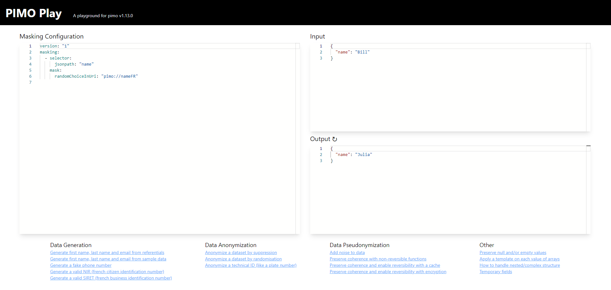

[](https://goreportcard.com/report/github.com/cgi-fr/pimo)


[](https://github.com/CGI-FR/PIMO/blob/main/README.md)
[](https://github.com/CGI-FR/PIMO/blob/main/README.chs.md)

# PIMO：私密输入，加密输出

PIMO 是一款用于加密数据的工具。它可以从 JSONline流 中加密数据，并根据包含在 YAML 文件中的加密配置返回另一个 JSONline流。


你可以使用 [LINO](https://github.com/CGI-FR/LINO) 从数据库中提取简单数据, 来输入到PIMO中来进行加密.
你也可以使用一个简单的yaml配置文件来生成简单数据.

## 必要的配置文件

PIMO 需要一个 YAML 配置文件才能运行。默认情况下，该文件的名称为 `masking.yml`，并放在工作目录中。文件必须遵循以下格式：

```yaml
version: "1"
seed: 42
functions:
    # 可选的自定义函数
masking:
  - selector:
      jsonpath: "example.example"
    mask:
      type: "argument"
    # 可选缓存（保持一致性）
    cache: "cacheName"
    # 用于加密的可选自定义因子
    seed:
      field: "example.example"

  # 不同位置上的另一个加密配置
  - selector:
      jsonpath: "example.example2"
    mask:
      type: "argument"
    preserve: "null"

caches:
  cacheName:
    # 可选双射缓存（如果缓存被写入磁盘，则启用重新识别）
    unique: true
    # 使用反向缓存词典
    reverse: true
```

`version` 是加密配置文件的版本。
`seed` 用于为每个随机加密提供相同的种子，它是可选的，如果未定义，种子将从当前时间生成以增加随机性。
`functions` 可以自定义函数在加密 `template`、`template-each`、`add` 和 `add-transient` 时使用的。
`masking` 用于定义要应用的加密的加密管道。
`selector` 由 jsonpath 和 mask 组成。
`jsonpath` 定义了必须在 json 文件中加密的入口的路径。
`mask` 定义了将用于由 `selector` 定义的入口的加密。
`cache` 是可选的，如果当前输入已经作为键存在于缓存中，则返回关联值，而不执行加密。否则，执行加密并将新条目添加到缓存，原始内容作为 `key`，加密结果作为 `value`。缓存必须在 YAML 文件的 `caches` 部分中声明。
`preserve` 是可选的，用于在 json 文件中保留某些未加密的值。允许的 `preserve` 选项包括：`"null"`（null 值）、`"empty"`（空字符串 `""`）和 `"blank"`（`empty`和 `null` 值）。此外，preserve 可与加密选项 [`fromCache`](#fromCache) 一起使用以保留未缓存的值（用法：`preserve: "notInCache"`)。

可以在相同的 jsonpath 位置应用多个加密选项，就像这个示例：

```yaml
  - selector:
      jsonpath: "example"
    masks:
      - add: "hello"
      - template: "{{.example}} World!"
      - remove: true
```

可以在多个 jsonpath 位置上应用加密，就像这个示例中：

```yaml
  - selectors:
      - jsonpath: "example"
      - jsonpath: "example2"
    mask:
      add: "hello"
```

可以定义函数并在后续的加密中重复使用，就像这个示例中：

```yaml
functions:
  add20:
    params:
      - name: "i"
    body: |-
      return i + 20
  sub:
    params:
      - name: "x"
      - name: "y"
    body: |-
      return x - y
masking:
  - selector:
      jsonpath: "addValue"
    mask:
      template: '{{add20 5}}'
  - selector:
      jsonpath: "subValue"
    mask:
      template: '{{sub 10 5}}'
```

## Possible masks

可以使用以下类型的加密：

* 纯随机化加密类
 * [`regex`](#regex) 使用作为参数提供的正则表达式进行加密。
  * [`randomInt`](#randomint) 使用参数 min 和 max 中的随机整数进行加密。
  * [`randomDecimal`](#randomdecimal) 使用参数 min、max 和 precision 中的随机小数进行加密。
  * [`randDate`](#randdate) 使用在 dateMin 和 dateMax 之间的随机日期进行加密。
  * [`randomDuration`](#randomduration) 通过添加或减去在 Min 和 Max 之间的随机时间来加密日期。
  * [`randomChoice`](#randomchoice) 从参数列表中随机选择一个值进行加密。
  * [`weightedChoice`](#weightedchoice) 根据给定的参数 `choice` 和 `weight` 以概率的方式从列表中选择一个值进行加密。
  * [`randomChoiceInUri`](#randomchoiceinuri) 用于从外部资源中加密成随机值。
  * [`randomChoiceInCSV`](#randomchoiceincsv) 用于从外部 CSV 资源中加密成随机值。
  * [`transcode`](#transcode) 用于保留字符类别并以随机方式加密值。
* K-Anonymization
  * [`range`](#range) 用于通过一定范围的值来加密整数值（例如，将 `5` 替换为 `[0,10]`）。
  * [`duration`](#duration) 用于通过添加或减去一定数量的天来加密日期。
* 重新识别类和保持一致性类
  * [`hash`](#hash) 通过匹配原始值来加密成列表中的值，允许每次以相同方式加密一个值。
  * [`hashInUri`](#hashinuri) 通过匹配原始值从外部资源中加密成一个值，允许每次以相同方式加密一个值。
  * [`hashInCSV`](#hashincsv) 通过从外部 CSV 资源中匹配原始值加密成一个新值，允许每次以相同方式加密一个值。
  * [`fromCache`](#fromcache) 是一种从缓存中获取值的加密方式。
  * [`ff1`](#ff1) 加密允许使用<abbr title="Format Preserving Encryption">FPE</abbr>，以启用基于私钥的重新识别。
* 格式化类
  * [`dateParser`](#dateparser) 用于更改日期格式。
  * [`template`](#template) 用于使用来自 jsonline 的其他值以模板方式加密数据。
  * [`template-each`](#template-each) 类似于模板，但会应用于数组的每个值。
  * [`fromjson`](#fromjson) 用于将字符串值转换为解析的 JSON，例如 "[1,2,3]" -> [1,2,3]。
* 数据结构操作类
  * [`remove`](#remove) 用于完全删除字段的加密类型。
  * [`add`](#add) 是一种将字段添加到 jsonline 的加密方式。
  * [`add-transient`](#add-transient) 与 `add` 相同，但该字段不会导出到输出的 jsonline 中。
* 其他
  * [`constant`](#constant) 通过参数中提供的常量值来进行加密。
  * [`command`](#command) 通过参数中提供的控制台命令的输出来进行加密。
  * [`incremental`](#incremental) 用于从 `start` 开始以 `increment` 的步进来加密数据。
  * [`fluxUri`](#fluxuri) 用外部资源中定义的序列值来替换原数据。
  * [`replacement`](#replacement) 用于使用 jsonline 中的另一个数据对数据进行加密。
  * [`pipe`](#pipe) 是一种处理复杂嵌套数组结构的加密方式，它可以将数组视为对象流并使用子管道处理它。
  * [`luhn`](#luhn) 可以使用 Luhn 算法生成符合规则的有效数字（例如，法国的 SIRET 或 SIREN）。
  * [`markov`](#markov) 可以根据样本文本生成伪文本。
  * [`findInCSV`](#findincsv) 从一个外部csv文件中提取与提供数据相符的一行或多行数据，并将其存入json流中。
  * [`xml`](#xml) 可以修改以字符串类型存储于 json 中的 xml 值。

源代码中提供了一个完整的 `masking.yml` 文件示例，包含每种加密方式。

如果使用相同的选择器输入两种类型的加密，程序将无法提取加密配置，并将返回错误。源代码中提供的 `wrongMasking.yml` 文件中说明了该错误。

## 使用

要使用PIMO来加密 `data.json`, 请跟随下列步骤：

```bash
./pimo <data.json >maskedData.json
```

这将读取 `data.json` 文件，对其中包含的数据进行加密，并将结果放入 `maskedData.json` 文件中。如果数据是在一个表格中（例如多个姓名），则该表格的每个指定字段将使用给定的加密方式进行加密。可以使用以下标志：

* `--repeat=N` 此标志将使 PIMO 对每个输入进行 N 次加密（用于数据集生成）。
* `--skip-line-on-error` 如果在加密字段时发生错误，则此标志将完全跳过一个加密过程。
* `--skip-field-on-error` 如果在加密此字段时发生错误，则此标志将返回输出而不包含该字段。
* `--skip-log-file <filename>` 被跳过的行将被写入指定的 `<filename>`。
* `--catch-errors <filename>` 或 `-e <filename>` 等效于 `--skip-line-on-error --skip-log-file <filename>`。
* `--empty-input` 此标志将为 PIMO 提供一个空 `{}` 输入，可与 `--repeat` 标志一起使用。
* `--config=filename.yml` 此标志允许使用不同于默认的 `masking.yml` 配置文件进行加密。
* `--load-cache cacheName=filename.json` 此标志从文件中加载初始缓存内容（json 行格式 `{"key":"a", "value":"b"}`）。
* `--dump-cache cacheName=filename.json` 此标志将最终缓存内容转储到文件中（json 行格式 `{"key":"a", "value":"b"}`）。
* `--verbosity <level>` 或 `-v<level>` 此标志可选择 Error日志 输出的详细程度，可选的值为：none（0）、error（1）、warn（2）、info（3）、debug（4）、trace（5）。
* `--debug` 此标志会将日志补充完整为调试信息（源文件、行数）。
* `--log-json` 设置此标志以生成 JSON 格式的日志（[demo9](demo/demo9) 深入了解日志和结构化日志）。
* `--seed <int>` 在命令行中设置此标志以声明种子。
* `--mask` 在命令行中声明一个简单的加密定义（缩小的 YAML 格式：`--mask "value={fluxUri: 'pimo://nameFR'}"`，或对于多个加密，使用 `--mask "value=[{add: ''},{fluxUri: 'pimo://nameFR'}]"`）。对于高级用例（例如，如果需要缓存），将更倾向于使用 `masking.yml` 文件定义。
* `--repeat-until <condition>` 此标志将使 PIMO 持续对每个输入进行加密，直到满足条件为止。条件格式使用[模板](https://pkg.go.dev/text/template)。最后一个输出验证条件。
* `--repeat-while <condition>` 此标志将使 PIMO 持续对每个输入进行加密，只要满足条件就会一直进行。条件格式使用[模板](https://pkg.go.dev/text/template)。
* `--stats <filename | url>` 此标志将运行统计信息输出到指定的文件或将其发送到指定的 URL（必须以 `http` 或 `https` 开头）。
* `--statsTemplate <string>` 此标志将使 PIMO 使用该值作为模板生成统计信息。请使用 go 模板格式包括统计信息。要包含它们，您必须将它们指定为 `{{ .Stats }}`（例如 `{"software":"PIMO","stats":{{ .Stats }}}`）。

### PIMO Play

`play` 命令将启动一个本地网站，在那里您将找到有注释的示例和一个可以使用加密配置进行交互的游乐场。

```console
$ pimo play
⇨ http server started on [::]:3010
```

然后在浏览器中打开地址 http://localhost:3010/。



## Examples

本部分将为每种类型的加密提供示例。

请查看 [演示文件夹](demo) 以获取更高级的示例。

### Regex

[](https://cgi-fr.github.io/pimo-play/#c=G4UwTgzglg9gdgLgAQCICMKBQBbAhhAayjgHMFMkkBaJCEAGxAGMAXGMcyrpAKwngAOuFgAtkKASPggs3PIU7ckYECRAAPcQAYA2mioB2ALoAKJCZ1aqATiMBKAN4AmAL6OALC5RA&i=N4KABGBEAOAWD2A7AppAXFADARjJgTHgMx4AseArJCAL5A)

```yaml
  - selector:
      jsonpath: "phone"
    mask:
      regex: "0[1-7]( ([0-9]){2}){4}"
```

此示例将使用符合正则表达式要求的随机字符串对输入 jsonlines 文件中的 `phone` 字段进行加密。

[返回到加密列表](#possible-masks)

### Constant

```yaml
  - selector:
      jsonpath: "name"
    mask:
      constant: "Bill"
```

此示例将使用 `constant` 字段的值对输入 jsonlines 的 `name` 字段进行加密。

[返回到加密列表](#possible-masks)

### RandomChoice

```yaml
 - selector:
      jsonpath: "name"
    mask:
      randomChoice:
       - "Mickael"
       - "Mathieu"
       - "Marcelle"
```

此示例将使用 `randomChoice` 列表中的随机值对输入 jsonlines 的 `name` 字段进行加密。

[返回到加密列表](#possible-masks)

### RandomChoiceInUri

```yaml
- selector:
      jsonpath: "name"
    mask:
      randomChoiceInUri: "file://names.txt"
```

该示例将使用名为 names.txt 文件列表中的随机值对输入的 jsonlines 的 `name` 字段进行加密。此选择可用的不同的 URI 为：`pimo`、`file` 和 `http`/`https`。

可以使用模板语法在 URI 中注入值。例如，如果当前的 JSON 行是 `{gender : "F"}`，则 `file://name{{.gender}}.txt` 会选择 `name_F.txt` 中的一行。

[返回到加密列表](#possible-masks)

### RandomChoiceInCSV

```yaml
version: "1"
masking:
  - selector:
      jsonpath: "pokemon"
    mask:
      randomChoiceInCSV:
        uri: "https://gist.githubusercontent.com/armgilles/194bcff35001e7eb53a2a8b441e8b2c6/raw/92200bc0a673d5ce2110aaad4544ed6c4010f687/pokemon.csv"
        header: true          # 可选：CSV 包含标题行，请使用它来命名字段，默认值为 false
        separator: ","        # 可选：CSV 值分隔符为 逗号默认值）
        comment: "#"          # 可选：CSV 包含以 # 开头的注释，如果为空则不期望注释（默认）
        fieldsPerRecord: 0    # 可选：每个记录的字段数，如果为 0，则设置为第一条记录中的字段数（默认）
                              # 如果为负数，则不进行检查，记录可能具有可变数量的字段
        trim: true            # 可选：修剪值和标题中的空格，默认值为 false
```

被选字段的数据将使用从指定 URL 处可用的 CSV 文件中随机选择的值进行加密（在本例中是 GitHub gist）。

以下是示例配置的详细分解：

* selector: jsonpath: "pokemon" 行表示该加密配置意图应用于 JSON 数据中命名为 "pokemon" 的字段。
* mask: 这定义了要在 "pokemon" 字段上执行的加密操作。
* randomChoiceInCSV: 该加密将使用指定 URL 处的 CSV 文件中的随机选择替换 "pokemon" 字段中的值。
* uri: 用于替换值的 CSV 文件的位置，可以使用 `file` 和 `http`/`https` 方案。此参数可以是模板。
* header: 此可选参数设置为 true，表示 CSV 文件包含一个命名字段的标题行。
* separator: 此可选参数指定 CSV 值由什么符号分隔，逗号是 CSV 文件中的默认分隔符。
* comment: 此可选参数指定 CSV 文件可能包含以 '#' 开头的注释。
* fieldsPerRecord: 此可选参数设置为 0，意味着默认情况下每个记录的字段数将设置为第一条记录中的字段数。如果为负数，则不进行检查，记录可能具有可变数量的字段。
* trim: 此可选参数设置为 true，意味着 CSV 文件中值和标题中的任何开头和结尾的多余空格将被删除。

[返回到加密列表](#possible-masks)

### RandomInt

```yaml
  - selector:
      jsonpath: "age"
    mask:
      randomInt:
        min: 25
        max: 32
```

该示例将使用介于 `min` 和 `max` 之间的随机整数对输入的 jsonlines 中的 `age` 字段进行加密。

[返回到加密列表](#possible-masks)

### RandomDecimal

```yaml
 - selector:
      jsonpath: "score"
    mask:
      randomDecimal:
        min: 0
        max: 17.23
        precision: 2
```

该示例将使用介于 `min` 和 `max` 之间的随机浮点数对输入的 jsonlines 的 `score` 字段进行加密，小数位数由 `precision` 字段选择。

[返回到加密列表](#possible-masks)

### Command

```yaml
  - selector:
      jsonpath: "name"
    mask:
      command: "echo -n Dorothy"
```

该示例将使用给定命令的输出对输入的 jsonlines 的 `name` 字段进行加密。在这种情况下，输出为 `Dorothy`。

[返回到加密列表](#possible-masks)

### WeightedChoice

[](https://cgi-fr.github.io/pimo-play/#c=G4UwTgzglg9gdgLgAQCICMKBQBbAhhAayjgHMFMkkBaJCEAGxAGMAXGMcyrpAKwngAOuFgAtkKCAFcwcXNhBZueQp25IA7iCgkRLEABMAwiJhQmIVWupImJsxdQARSQPgtFVrpu27kATgpPGltTc3FnVzh9D08NLR0WZDQgA&i=N4KABGBEDOCuBOA7AhgWwKaQFxQBLIBMCB7AYwGtIQBfIA)

```yaml
  - selector:
      jsonpath: "surname"
    mask:
      weightedChoice:
        - choice: "Dupont"
          weight: 9
        - choice: "Dupond"
          weight: 1
```

该示例将使用 `weightedChoice` 列表中的随机值对输入的 jsonlines 的 `surname` 字段进行加密，其加密概率与 `weight` 字段成正比。

[返回到加密列表](#possible-masks)

### Hash

[](https://cgi-fr.github.io/pimo-play/#c=G4UwTgzglg9gdgLgAQCICMKBQBbAhhAayjgHMFMkkBaJCEAGxAGMAXGMcyrpAKwngAOuFgAtkKNgHc4WbnkKduSEfjEUllGigCi2cLnoATJAGEoLAJ6yN1VACUArgCMLp81fUatAZVwCBIlBgIG6WKEA&i=N4KABGBEAuD2DuA7SAuKAFAhgJwJYGdIQBfIA)

```yaml
  - selector:
      jsonpath: "town"
    mask:
      hash:
        - "Emerald City"
        - "Ruby City"
        - "Sapphire City"
```

该示例将使用 `hash` 列表中的值对输入的 jsonlines 中的 `town` 字段进行加密。值将通过对原始值进行哈希函数处理，以确保在输入相同的情况下，输出始终相同。

[返回到加密列表](#possible-masks)

### HashInUri

[](https://cgi-fr.github.io/pimo-play/#c=G4UwTgzglg9gdgLgAQCICMKBQBbAhhAayjgHMFMkkBaJCEAGxAGMAXGMcyrpAKwngAOuFgAtkKOLmwgs3PIU7ckI-CICScAKpgo4gVGwwEAemOTpAMQBKKIA&i=N4KABGBEB2CGC2BTSAuKAhAlgG25EAvkA)

```yaml
  - selector:
      jsonpath: "name"
    mask:
      hashInUri: "pimo://nameFR"
```

该示例将使用 pimo 中包含的名为 nameFR 列表中的值对输入的 jsonlines中 的 `name` 字段进行加密，与 `hash` 加密方式相同。此选择器可用的不同 URI 为：`pimo`、`file`、`http`/`https`。

[返回到加密列表](#possible-masks)

### HashInCSV

[](https://cgi-fr.github.io/pimo-play/#c=G4UwTgzglg9gdgLgAQCICMKBQBbAhhAayjgHMFMkkBaJCEAGxAGMAXGMcyrpAKwngAOuFgAtkKATAIhs8LNzyFO3JCPwiAknADCAZQBqylUgCuYKOJEsWAiAgD09klAgsAdM9EmARibpgmeBYQOHdA7HtcMGxnekYIezQATgAWbyYAMwyAZgBWAAZ8tBAAdhBvXOzcACZcAA5vFJTihuqmADZ7MFwAd3sk6urC9PzcdpLsgBNcphBqtDRR3FxJlNymkEn2phSi-Iz2upL7SWlZODcmCGB5Y1UQFfBkFjATEDuuAGIkGAEWWDguHoyCuwFU+CQuHujzASHoxBAmCAA&i=N4KABGBEAOD2DWBTAtrAdpAXFAgpEAvkA)

```yaml
version: "1"
masking:
  - selector:
      jsonpath: "pokemon"
    mask:
      hashInCSV:
        uri: "https://gist.githubusercontent.com/armgilles/194bcff35001e7eb53a2a8b441e8b2c6/raw/92200bc0a673d5ce2110aaad4544ed6c4010f687/pokemon.csv"
        header: true          # 可选参数: CSV 文件包含标题行，请使用它来命名字段，默认值为 false
        separator: ","        # 可选参数: CSV 值的分隔符是逗号，默认值
        comment: "#"          # 可选参数: CSV 包含以 # 开头的注释行，如果为空，则不期望任何注释行（默认）
        fieldsPerRecord: 0    # 可选参数: 每条记录的字段数，如果为 0，则将其设置为第一条记录中的字段数（默认）
                              # 如果为负值，则不进行检查，记录可能具有可变数量的字段
        trim: true            # 可选参数: 在值和标题中修剪空格，默认为 false

```

所选字段的数据将使用从指定 URL（在本例中为 GitHub gist）的 CSV 文件中选择的随机值进行加密。该值将通过对原始值进行哈希选择，以确保在输入相同的情况下，输出始终相同。

详细配置可参见[RandomChoiceInCSV](#randomchoiceincsv) 中的例子。

[返回到加密列表](#possible-masks)

### RandDate

[](https://cgi-fr.github.io/pimo-play/#c=G4UwTgzglg9gdgLgAQCICMKBQBbAhhAayjgHMFMkkBaJCEAGxAGMAXGMcyrpAKwngAOuFgAtkKACbCQWbnkKduSMLjgSAItMVKkUliACyxcWgCcAdgAMVS2htoAKpcsJnrywC1ZO3dIO4AD3EAJktQ+3snFzdnLyA&i=N4KABGBEAmCGAuBTSAuKkQF8g)

```yaml
  - selector:
      jsonpath: "date"
    mask:
      randDate:
        dateMin: "1970-01-01T00:00:00Z"
        dateMax: "2020-01-01T00:00:00Z"
```

该示例将使用介于 `dateMin` 和 `dateMax` 之间的随机日期对输入的 jsonlines 的 `date` 字段进行加密。在本例中，日期将介于1970年1月1日和2020年1月1日之间。

[返回到加密列表](#possible-masks)

### Duration

[](https://cgi-fr.github.io/pimo-play/#c=G4UwTgzglg9gdgLgAQCICMKBQBbAhhAayjgHMFMkkBaJCEAGxAGMAXGMcyrpAKwngAOuFgAtkKevhYB9JvBa5WWbnkKduSACYBXMMNiJUVAAoAmACIogA&i=N4KABGBEA2CGDOAXA+gYwPYDtG1YyAXFAEwAMZAtKQIxXUAqppBTLpAWpCAL5A)

```yaml
  - selector:
      jsonpath: "last_contact"
    mask:
      duration: "-P2D"
```

该示例将使用减去2天的值来加密输入的 jsonlines 的 `last_contact` 字段。持续时间字段应与 ISO 8601 持续时间标准相匹配。

[返回到加密列表](#possible-masks)

### DateParser

[](https://cgi-fr.github.io/pimo-play/#c=G4UwTgzglg9gdgLgAQCICMKBQBbAhhAayjgHMFMkkBaJCEAGxAGMAXGMcyrpAKwngAOuFgAtkKACbCQWbnkKduSKSxAAFXJHCKlSYgICuLAGLs8LcQCYADNYBsVa2keXZupDCOGTZ4eKcA9NaWQXYoQA&i=N4KABGBEAmCGAuBTSAuKAmADOgzAWkwDYCBWSEAXyA)

```yaml
  - selector:
      jsonpath: "date"
    mask:
      dateParser:
        inputFormat: "2006-01-02"
        outputFormat: "01/02/06"
```

该示例将更改 date 字段中的每个日期从 `inputFormat`格式 转换到 `outputFormat`格式。格式应始终显示以下日期：`Mon Jan 2 15:04:05 -0700 MST 2006`。
任一字段都是可选的，如果未定义，则默认格式为 RFC3339，这是 PIMO 的基本格式，是 `duration` 加密所需的格式，并由 `randDate` 加密给出。可以通过指定 `inputFormat: "unixEpoch"` 或 `outputFormat: "unixEpoch"` 来使用 Unix 时间格式。

[返回到加密列表](#possible-masks)

### RandomDuration

[](https://cgi-fr.github.io/pimo-play/#c=G4UwTgzglg9gdgLgAQCICMKBQBbAhhAayjgHMFMkkBaJCEAGxAGMAXGMcyrpAKwngAOuFgAtkKACbCQWbnkKduSMLjgSY2ACIBXFS1iIKSytmLiqABQBMm2caR4AHuesB2W0A&i=N4KABGBEAmCGAuBTSAuKAmADFgtJgjHvgCqaYpkWYBakIAvkA)

```yaml
  - selector:
      jsonpath: "date"
    mask:
      randomDuration:
        min: "-P2D"
        max: "-P27D"
```

该示例将使用2到27天之间的随机值减少输入 jsonlines 的 `date` 字段的值。持续时间应符合 ISO 8601 标准。

[返回到加密列表](#possible-masks)

### Incremental

[](https://cgi-fr.github.io/pimo-play/#c=G4UwTgzglg9gdgLgAQCICMKBQBbAhhAayjgHMFMkkBaJCEAGxAGMAXGMcyrpAKwngAOuFgAtkKKABMs3PIU7ckxJmBDYQcFrnoLFtLWBbI0FPUrgq1Go0jRA&i=N4KABGBECWAmkC4wAYQF8g)

```yaml
  - selector:
      jsonpath: "id"
    mask:
      incremental:
        start: 1
        increment: 1
```

该示例将使用递增值来加密输入 jsonlines 的 `id` 字段。第一个 jsonline 的 `id` 将被加密为 1，第二个为 2，依此类推...

[返回到加密列表](#possible-masks)

### Replacement

[](https://cgi-fr.github.io/pimo-play/#c=G4UwTgzglg9gdgLgAQCICMKBQBbAhhAayjgHMFMkkBaJCEAGxAGMAXGMcyrpAKwngAOuFgAtkKOLmwgALFm55CnbkjAgB9XExDS4LcZOkogA&i=N4KABGBEB2CGC2BTSAuKBBaATATgS8gBpwo4kAWVKAKQHs4AXAC1mkhAF8g)

```yaml
  - selector:
      jsonpath: "name4"
    mask:
      replacement: "name"
```

该示例将使用jsonline的 `name` 字段的值来加密输入jsonlines的 `name4` 字段。如要使用新值进行加密，此选择器必须放置在 `name` 选择器之后，反之必须在 `name` 选择器之前放置。

[返回到加密列表](#possible-masks)

### Template

[](https://cgi-fr.github.io/pimo-play/#c=G4UwTgzglg9gdgLgAQCICMKBQBbAhhAayjgHMFMkkBaJCEAGxAGMAXGMcyrpAKwngAOuFgAtkKPFHpZueQp25IWIbAPrCQ4gN5aAdBACuYOLmwgkAHyQA5GAEEmTEHBaWk9GAHdwAXx+6dXRMzN1sHJxc3D28wPwABEkl6XSYYbBQgA&i=N4KABGBEDOCuBOA7AhgWwKaQFxQIKIBN4BLyAGnChQ2ygCkB7FAFwAtlFzLJVkBLADa1EsAQJABfIA)

```yaml
  - selector:
      jsonpath: "mail"
    mask:
      template: "{{.surname}}.{{.name}}@gmail.com"
```

该示例将使用给定模板来加密输入jsonlines的 `mail` 字段。在 `masking.yml` 配置文件中，此选择器必须放置在模板中包含的字段之后以使用新值进行加密，反之必须放置在要使用旧值之前。对于嵌套的json，模板必须遵循以下示例：

```yaml
  - selector:
      jsonpath: "user.mail"
    mask:
      template: "{{.user.surname}}.{{.user.name}}@gmail.com"
```

模板的格式应符合 `text/template` 包的规范： <https://golang.org/pkg/text/template/>

模板加密可以格式化所使用的字段。以下示例将创建一个无音标或大写字母的邮件地址：

```yaml
  - selector:
      jsonpath: "user.mail"
    mask:
      template: "{{.surname | NoAccent | upper}}.{{.name | NoAccent | lower}}@gmail.com"
```

模板的可用函数来自 <http://masterminds.github.io/sprig/>.

大多数可用的加密模板函数可以在 MaskCapitalizedMaskName 找到。

```yaml
  - selector:
      jsonpath: "mail"
    masks:
      - add: ""
      - template: '{{MaskRegex "[a-z]{10}"}}.{{MaskRegex "[a-z]{10}"}}.{{MaskRandomInt 0 100}}@gmail.com'
```

[返回到加密列表](#possible-masks)

### Template each

[](https://cgi-fr.github.io/pimo-play/#c=G4UwTgzglg9gdgLgAQCICMKBQBbAhhAayjgHMFMkkBaJCEAGxAGMAXGMcyrpAKwngAOuFgAtkKXGDC4Anlm55CnbkhYhsA+sJBUQuJmIorKajVrXiA3pZZQWjJADpguegFcQAX0-zjSO+riLu4gKEA&i=N4KABGBECGBOvQJ6QFxgNqQG7QDYFcBTARkgBoocDCAmSAXRAF8g)

```yaml
  - selector:
      jsonpath: "array"
    mask:
      template-each:
        template: "{{title .value}}"
        item: "value"
```

这将影响数组字段中的每个值。该字段必须是一个数组 `({"array": ["value1", "value2"]})`。
`item` 属性是可选的，定义模板字符串中当前项目的名称（默认为 "it"）。还有另一个可选属性 `index`，如果定义，则模板字符串中将可用具有给定名称的属性（例如：`index: "idx"` 可以在模板中使用 `{{.idx}}`）。

模板的格式应符合 `text/template` 包的规范: <https://golang.org/pkg/text/template/>

有关其他选项，请参见 [Template mask](#template), 所有函数都适用于 `template-each`。

[返回到加密列表](#possible-masks)

### Fromjson

[](https://cgi-fr.github.io/pimo-play/#c=G4UwTgzglg9gdgLgAQCICMKBQBbAhhAayjgHMFMkkBaJCEAGxAGMAXGMcyrpAKwngAOuFgAtkKFrjAkQLAGZQGAEyzc8hTtyRywMbH3jj+AVzBMQC5SiA&i=N4KABGBEDOD2CuAnAxgUwGYEtUBsAmkAXFMADqQBWcAducQIwC+kANOFAC4CGiA5qhyy4CxavBw4QjIA)

```yaml
  - selector:
      jsonpath: "targetfield"
    mask:
      fromjson: "sourcefield"
```

此示例将使用jsonline的 `sourcefield` 字段中的解析JSON来加密输入文件jsonlines中的 `targetfield` 字段。此加密更改输入字符串 (`sourcefield`) 的类型：

* null : nil
* string: string
* number: float64
* array:  slice
* object: map
* bool: bool

[返回到加密列表](#possible-masks)

### Remove

[](https://cgi-fr.github.io/pimo-play/#c=G4UwTgzglg9gdgLgAQCICMKBQBbAhhAayjgHMFMkkBaJCEAGxAGMAXGMcyrpAKwngAOuFgAtkKAK51GECFQBmUBgBMs3PIU7ckYENhihkLMBJBA&i=N4KABGBECuDOCmAbetYFoBmBLJATSAXFABZKID2kIAvkA)

```yaml
  - selector:
      jsonpath: "useless-field"
    mask:
      remove: true
```

这个示例将通过完全删除它来掩盖输入jsonlines的 `useless-field` 字段。

[返回到加密列表](#possible-masks)

### Add

[](https://cgi-fr.github.io/pimo-play/#c=G4UwTgzglg9gdgLgAQCICMKBQBbAhhAayjgHMFMkkBaJCEAGxAGMAXGMcyrpAKwngAOuFgAtkKOCADuAMSgMAJlm55CnbklwKF4yVOC56AVxAogA&i=N4XyA)

```yaml
  - selector:
      jsonpath: "newField"
    mask:
      add: "newvalue"
```

此示例将创建包含值 `newvalue` 的字段 `newField`。此值可以是字符串、数字、布尔值等。

该字段将在每个不包含此字段的jsonline中创建。

注意：add 可以包含模板字符串 (有关更多信息，请参见 [Template](#template)).

[返回到加密列表](#possible-masks)

### Add-Transient

[](https://cgi-fr.github.io/pimo-play/#c=G4UwTgzglg9gdgLgAQCICMKBQEQgCbIAsATJgLYCGEA1lHAOYKaZJIC0SOANiAMYAuMME1aikAKwjwADhX4ALZCn5gKcaCDj8A+gDMoILnixjKNEWKQU8eNirUatSgN7PVcPAEEu0+RQByAK5kSADMAL7hWCzsnIZ8gsIxYpIycoqo+obGyUhm1BZi1gSoACryIEjyUDaaSMAUXIGVUBBIyK4AdPbqBlp6BkaRWEA&i=N4XyA)

```yaml
  - selector:
      jsonpath: "newField"
    mask:
      add-transient: "newvalue"
```

此示例将创建包含值 `newvalue` 的字段 `newField`。此值可以是字符串、数字、布尔值等。它也可以是模板。

该字段将在每个不包含此字段的输入jsonline中创建，并且它将从最终JSONLine输出中删除。

此加密用于仅在执行期间可用于其他字段加密的临时字段。

注意：add-transient 可以包含模板字符串 (有关更多信息，请参见 [Template](#template)).

[返回到加密列表](#possible-masks)

### FluxURI

[](https://cgi-fr.github.io/pimo-play/#c=G4UwTgzglg9gdgLgAQCICMKBQBbAhhAayjgHMFMkkBaJCEAGxAGMAXGMcyrpAKwngAOuFgAtkKATAIhs8CADoAJsNxZueQp25IAZvQCuADwCqYKOJEsWAiAgD0dklAgt5T0foBG+umCbwWEDhXf2w7XDBsJ3pGCDs0AE4AFk8mHR0AZgBWAAYctBAAdhBPLIzcACZcAA5PJKSC2oqmADY7MFwAdzsEioq81JzcFsKMxSymEAq0NCHcXEUkrPqQRRamJPycnRbqwrtJaVk4eSYIYCwgA&i=N4WAUABBBEAOD2BrApgW3gOwM7QFwQG1wophoATAQwBdK8IMBXAG2YF8AaYksq2+pq07dSFGnXyD2XSDzH9JLaSIi9xApW24BdcGyA)

```yaml
  - selector:
      jsonpath: "id"
    mask:
      fluxURI: "file://id.csv"
```

此示例将在每个输出的 JSON 行中创建一个 `id` 字段。值将与 `id.csv` 文件中的值相同，顺序也相同。如果输入的 JSON 行中已经存在该字段，它将被替换；如果文件中的每个值已经被分配，则不会修改输入的 JSON 行。

[返回到加密列表](#possible-masks)

### FromCache

```yaml
  - selector:
      jsonpath: "id"
    mask:
      fromCache: "fakeId"
  caches:
    fakeId :
      unique: true
      reverse: false
```

这个例子会用缓存 `fakeId` 中匹配的内容来替换 `id` 字段的内容。缓存必须在 `caches` 部分中声明。
可以使用 `--load-cache fakeId=fakeId.jsonl` 选项从json文件中加载缓存内容，或者通过另一个字段的 `cache` 选项加载缓存。
如果在缓存中找不到匹配项，`fromCache` 将阻塞当前行，直到有匹配的内容进入缓存。
在 `caches` 部分中有一个 `reverse` 选项可用于使用反向缓存字典。

[返回到加密列表](#possible-masks)

### FF1

[](https://cgi-fr.github.io/pimo-play/#c=G4UwTgzglg9gdgLgAQCICMKBQBbAhhAayjgHMFNMkkBaJCEAGxAGMAXGMcq7pAKwngAHXKwAWyFFAAmIOKygAzKOCw88hLjyQKFaTVqQEQATwBiYGNgCicYBNOm0AfSsA5AMIAlAJoAFACoAkgDyrk4A0lbeqgZIUpa4xBIADGgATADMACwArABsAOwAHACcKEgAxEi4DAxIgjAQ0ABGTEjMorhguGzgEEjE1XRQYCCslLGCo-RgoMisYACuIJUDCkgLywA07Z2QSDCLrNAyB+tiK-F4gwDuULVIzStTIDOgUgNwB0eCRxMG8CsYAsnCQAHJArYatIkMAasskABvRFIAB00lk8iU4CQAF9cWDVoo6GMdmIoP1WCBsIIGCIVncHk8kCAAB4sI4gD7wFnAjgUKhVfwwOIsMDGQSsIZwhgIxb0UXMcWS+ZLEATWj0JhsDj6bj8IQicSoDFyRTKMBOGRKiVUqQxKjqAgQPVUWi4KRSCTI9EyM3YsD4h3cWg6PT-WJGMwWay2eyOFweHwBEJhSLRCMGK6JRCoVKZXKFUrBgwvN4gVXLTNaQF80EQqEMGEyhHItGmrEWvEE6s8a3K1iV9VAA&i=N4KABGBECWAmCmA7ALtAZteAnSAuKAHAEwDMBBAnAGwC0ALKSQKx2UWQgC+QA)

```yaml
  - selector:
      jsonpath: "siret"
    mask:
      ff1:
        keyFromEnv: "FF1_ENCRYPTION_KEY"
        domain: "0123456789" # all possible characters in a siret
        onError: "Invalid value = {{ .siret }}" # if set, this template will be executed on error
```

这个例子将使用以base64编码的私钥加密 `siret` 列。使用相同的加密，并使用 `decrypt: true` 选项可以重新识别未屏蔽的值。

可以使用 `preserve: true` 选项保留域之外的字符。

确保查看 [完整的FPE演示](demo/demo7) 以获取有关此加密的更多详细信息。

[返回到加密列表](#possible-masks)

### Range

[](https://cgi-fr.github.io/pimo-play/#c=G4UwTgzglg9gdgLgAQCICMKBQBbAhhAayjgHMFMkkBaJCEAGxAGMAXGMcyrpAKwngAOuFgAtkKXCRBZueQp25IwuUiGQBWIA&i=N4KABGBECGDmCmkBcUDskQF8g)

```yaml
  - selector:
      jsonpath: "age"
    mask:
      range: 5
```

这个加密会将整数值 `{"age": 27}` 替换为一个类似这样的范围 `{"age": "[25;29]"}`.

[返回到加密列表](#possible-masks)

### Pipe

[](https://cgi-fr.github.io/pimo-play/#c=G4UwTgzglg9gdgLgAQCICMKBQEQgCbIAsATJgLYCGEA1lHAOYKZJIC0SOANiAMYAuMMExYikAYiR8AFlAhIADhWkKYdPnIFIKcLWDAUAnkhgAzBeAjwIzUUgBWluIunIUg+tqgAvJbDgQAOnkLKyxRShphWwkoPiQAdyhOTiQAIxAFKGC8SRhJKQyI2gZM4M46DLwQEzpYvzSQThh4m1F5LJAo23F8jMUwEDg4mFS7XjiACgokPBhKOgBKBKSU9K0eHhAIaFTuZeVpDJQAfRQkYAowKApdjLgKMhBW2zox-gAFS8G+V1Pn8KoxUY-1s7C440EXW6tgc8GcUlc90eYWhAMiINREhqjTwcjo0CqvXMkHgxlG4yQPG0DXWm22+BmUAG-E4Bgx0L4IDI8k4Sk6qAA3gLJLE9gEkRkAL6SlGosGNCFCdndWFOJQI1AQACuYAlstRSCKUINki5PL5riFIr4Yu1uoeUplyrYHAV-EhztEqvhri5FCS+tRRs9Igkh3OFE4WoyEAEAxy+KghPD-W+ZLecVktK2Oz20jAMC19CkqFO+W01A0eRTXyGSFe4z8IZYnO5vM5luFTXi4CQ4odSGlASt3d7ATtEsHkoAAlaAscArN5jppVggA&i=N4KABGBED2BODmBDAdgSwF6IC6usgzpAFxgDa4EYollkAJtALaKrLFQDGTADigJ4A6Lo0gAaCjUjcAprHx5CJcjRrUVk5IkbT2kADbS8iMRPVR8AV1ibtuxqj0HYJs7WnMHuyKZoBfca5qrpA2OiSQAFbQOgGu5lahunSIAG6ohLHB7ix6Xj6UvvkAuqb+pkG0DB5s4cK8yIIAZs6ZtDJyCuzKZhXqIVphUIh6LGytfZbWA3ayHKiyLnGQ2Z7h3q5lgfka0+GNenCoKIvBk4nhBvCwKHQnZsseuWvbYIXqJX4UJb5AA)

如果数据中含有向下列例子中的列表数据， 这个加密选项可以添加一个附属管道来分别加密列表中的数据。

**`data.jsonl`**

```json
{
    "organizations": [
        {
            "domain": "company.com",
            "persons": [
                {
                    "name": "leona",
                    "surname": "miller",
                    "email": ""
                },
                {
                    "name": "joe",
                    "surname": "davis",
                    "email": ""
                }
            ]
        },
        {
            "domain": "company.fr",
            "persons": [
                {
                    "name": "alain",
                    "surname": "mercier",
                    "email": ""
                },
                {
                    "name": "florian",
                    "surname": "legrand",
                    "email": ""
                }
            ]
        }
    ]
}
```

**`masking.yml`**

```yaml
version: "1"
seed: 42
masking:
  - selector:
      # 此路径指向人员数组
      jsonpath: "organizations.persons"
    mask:
      # 它将被管道加入到下面的加密管道定义中
      pipe:
        # 父对象（一个域）将通过“_”变量名称来访问
        injectParent: "_"
        masking:
          - selector:
              jsonpath: "name"
            mask:
              # 人员对象内部的字段可以直接访问
              template: "{{ title .name }}"
          - selector:
              jsonpath: "surname"
            mask:
              template: "{{ title .surname }}"
          - selector:
              jsonpath: "email"
            mask:
              # 通过父对象注入，存储在父对象内的值可以通过“_”访问
              template: "{{ lower .name }}.{{ lower .surname }}@{{ ._.domain }}"
```

除了 `injectParent` 属性外，该加密还提供了 `injectRoot` 属性，用于注入整个数据结构。

可以通过引用外部yaml定义来简化 `masking.yml` 文件：

```yaml
version: "1"
seed: 42
masking:
  - selector:
      jsonpath: "organizations.persons"
    mask:
      pipe:
        injectParent: "domain"
        file: "./masking-person.yml"
```

请确保查看 [demo](demo/demo8) 以获取有关此加密的更多详细信息。

[返回到加密列表](#possible-masks)

### Luhn

[](https://cgi-fr.github.io/pimo-play/#c=G4UwTgzglg9gdgLgAQCICMKBQEQgCbIAsATJgLYCGEA1lHAOYKZJIC0SOANiAMYAuMMExYikAKwjwADhT4ALZCmhgQfLKMo1hopJwCucxEgDeAXyA&i=N4KABGBEDOCWBOBTALpAXFAjAJgMwBYBWANgHYAOATgAYddIQBfIA)

[Luhn](https://en.wikipedia.org/wiki/Luhn_algorithm) 算法是一种用于验证各种标识号的简单校验和公式。

luhn 加密可以为任何值计算校验和。

```yaml
  - selector:
      jsonpath: "siret"
    mask:
      luhn: {}
```

在这个示例中，`siret` 值将附加正确的校验和，以创建有效的 SIRET 号码（法国企业标识）。

该加密可以参数化为符合不同规则的有效字符集，内部使用 [Luhn mod N](https://en.wikipedia.org/wiki/Luhn_mod_N_algorithm) 算法。

```yaml
  - selector:
      jsonpath: "siret"
    mask:
      luhn:
        universe: "abcde"
```

[返回到加密列表](#possible-masks)


### Markov

[](https://cgi-fr.github.io/pimo-play/#c=G4UwTgzglg9gdgLgAQCICMKBQBbAhhAayjgHMFMkkBaJCEAGxAGMAXGMcyrpAKwngAOuFgAtkKOLmwgs3PIU7ckeMARjBFS2lIGNxAqNhgIA9CcnSAYgCVZW5bgAeVaAC8QyNAAYgA&i=N4WAUABBBEB2CGBbAptAXDa4C+Q)

[Markov chains](https://en.wikipedia.org/wiki/Markov_chain#Markov_text_generators) 马尔可夫链 可根据样本文本生成伪文本。

**sample.txt**

```txt
I want a cheese burger
I need a cheese cake
```

**masking.yml**

```yaml
  - selector:
      jsonpath: "comment"
    mask:
      markov:
        max-size: 20
        sample: "file://sample.txt"
        separator: " "
```

这个示例将输入 JSON 行的 surname comment 内容使用由 markov 加密生成的随机值 comment 进行加密，其阶数为 `2`。

**sample.txt** 的加密后将是：

```txt
I want a cheese burger
I need a cheese burger
I want a cheese cake
I need a cheese cake
```

`separator` 字段定义样本文本的分隔方式（`""` 用于按字符拆分，`" "` 用于按单词拆分）。

[返回到加密列表](#possible-masks)

### Transcode

[](https://cgi-fr.github.io/pimo-play/#c=G4UwTgzglg9gdgLgAQCICMKBQBbAhhAayjgHMFNMkkBiJAFQAsQkAXMXOCAYxgBNm8hJAHcoAGzFIwIAA5jcXZrglIuDXOy4twEJMV5RgUXgFdlYgJ6UaSAEIWk-AGa4TYlknJVaAWiQBVAAVAgFEAJQBhAEEAZRCkMRAWbUgRcUkAI2ZpOQUQXiQMh3Y4XhhsAODw6LiEpJSIa18EmGFwLnxmROSdNJUsqVl5RQKiqQ4yirFW9s66nsgmpD8DEigWXVF+7KG80eKJ8scoNY2lv3MkGBYmMFV1TQa+zOYTOBYYEzV86z8IEESWhgkC8VDBfgAVhB4DJcDdkChctoAPpwEzYLJgLBg8FIKEwuEMBH-MBQZTYsGCAignFsDjcPggZAAbwAvhRvPQmPcNAoUqp5BB-roOnBCsweHAnCcTNICh8eaRmDdmM5XO5xeojMDfkh-oCPmAaWD8XBYfDUEwAB7I4DKEwgClUKnGqh0zg8fiusFcQXC71UPzEGQmFgIgAMaAATABmAAsAFYAGwAdgAHABOKK2CIAERCADEnTiwZ8WCGw6hI7HE6nM9m84WsEtGFBdFTVBwkMpoeKkCZ-qwYHqTDJpELHHDcLr9SAgUbrDjTeaiagOmBeKj0Zjiy7F2D3Qyvfucb78P6T7jg6GI9H48n0xniyWrqGKwiAFRYIA&i=N4KABGBEAOA2CGAXApgfQHYFcC2AjZATpAFxQCCAQgLQCMATAMxUDCAIpADThQDOhAlvFgko9BgBYArADZajcXIlVKbTt0gALZAA9UANyGZkIyGRoAOAKKopFMqgBiFyajYB2N2oiQAxvAIAJhg4+ESkkGJSspGKCirsIAC+QA)

这个加密通过保留原始值的字符类别来生成随机字符串。

**masking.yml**

```yaml
- selector:
    jsonpath: "id"
  mask:
    transcode:
      classes:
      - input: "0123456789abcdefABCDEF"
        output: "0123456789abcdef"
```

这个示例将原始 id 值从 `input` 类中的每个字符替换为 `output` 类中的随机字符来进行加密。

```console
$ echo '{"id": "1ef619-90F"}' | pimo
{"id": "d8e203-a92"}
```

默认情况下，如果没有另行指定，将使用以下类别（输入 -> 输出）：

* 小写字母 -> 小写字母
* 大写字母 -> 大写字母
* 数字 -> 数字

```yaml
# 这个配置：
- selector:
    jsonpath: "id"
  mask:
    transcode: {}
# 等同于：
- selector:
    jsonpath: "id"
  mask:
    transcode:
      classes:
        - input: "abcdefghijklmnopqrstuvwxyz"
          output: "abcdefghijklmnopqrstuvwxyz"
        - input: "ABCDEFGHIJKLMNOPQRSTUVWXYZ"
          output: "ABCDEFGHIJKLMNOPQRSTUVWXYZ"
        - input: "0123456789"
          output: "0123456789"
```

[返回到加密列表](#possible-masks)

### FindInCSV

[](https://cgi-fr.github.io/pimo-play/#c=G4UwTgzglg9gdgLgAQCICMKBQBbAhhAayjgHMFMkkBaJCEAGxAGMAXGMcyrpAKwngAOuFgAtkKYgDMYWbnkIRO3aklwATNUnGzlNScTUBJOAGEAygDUlyrgFcwUcSJYsBigPTuSUCCwB03qK2AEa2dGBM8CwgcP6R2O64YNje9IwQ7mgAnAAswUySkgDMAKwADGVoIADsIMElRbgATLgAHME5OVXtTUwAbO5guADu7llNTRX5Zbh91UVqJUwgTWhoM7jqOSWdIGp9TDmVZZJ9rdXuAjAEINjwfkwQwDo2lCAAHrisALLCTGIUV7cR7AZAAcgA3hCABQGD5IPyoAAqAE8BCAkBgAJRIAA+SHoMGG4CQAF9SWDAUC3rEwCjxFC-Cw0SAAPpockvV48L5MJJqazUkHgxkAOVw2Ax+MJxLAZIpVOpMRYdIZEL8cAlUpl4E51K4ipsH3RrD24mEVEY+BYVHgIC5NhEIHU4GQKtsIENyhVUGwbrAHswQA&i=N4KABGBEAuCeAOBTA+gRkgLigMwJYCdFIAacKAOwEMBbIrSAY0v1vIBNF9IQBfIA)

此加密将目标值或值组合从 JSON 条目与 CSV 文件中的值进行比较，并将匹配的 CSV 行插入到 JSON 条目的指定字段中。

```json
{"type_1": "fire", "name": "carmender"}
```

[返回到加密列表](#possible-masks)

#### Input CSV

```csv
#,Name,Type 1,Type 2,Total,HP,Attack,Defense,Sp. Atk,Sp. Def,Speed,Generation,Legendary
1,Bulbasaur,Grass,Poison,318,45,49,49,65,65,45,1,False
...
4,Charmander,Fire,,309,39,52,43,60,50,65,1,False
...
```

[](https://gist.githubusercontent.com/armgilles/194bcff35001e7eb53a2a8b441e8b2c6/raw/92200bc0a673d5ce2110aaad4544ed6c4010f687/pokemon.csv)

```yaml
version: "1"
masking:
  - selector:
      jsonpath: "info"
    masks:
        - add : ""                                       # 在 JSON 条目中添加 "info" 键并赋值为 ""
        - findInCSV:
            uri: "https://gist.githubusercontent.com/armgilles/194bcff35001e7eb53a2a8b441e8b2c6/raw/92200bc0a673d5ce2110aaad4544ed6c4010f687/pokemon.csv"
            exactMatch:                                  # 可选的：您可以仅使用 exactMatch 或两者都使用
                csv: '{{(index . "Type 1") | lower }}'
                entry: "{{.type_1}}"
            jaccard:                                     # 可选的：您可以仅使用 jaccard 或两者都使用
                csv: "{{.Name | lower }}"
                entry: "{{.name |lower}}"
            expected: "at-least-one"                     # 可选的：only-one、at-least-one 或 many，默认值为 at-least-one
            header: true                                 # 可选的：CSV 文件包含标题行，使用它来命名字段，默认值为 false
            trim: true                                   # 可选的：修剪值和标题中的空格，默认值为 false

```

在这个场景中，`findInCSV` 加密被应用于 JSON 条目中的 "info" 字段。该加密同时利用了精确匹配和Jaccard相似性匹配。`expected: "at-least-one"` 配置将返回最相似的 CSV 行，然后将其保存在 info 字段中。如果使用 `expected: "many"`，Jaccard 匹配将按相似度顺序返回所有预期匹配的行。
如果使用 `expected: "only-one"`，如果匹配产生多于一行的结果，则会报错。Jaccard 匹配通过利用 Jaccard 相似性度量来处理条目中的变化，例如重音或字母大小写的差异，从而提供了灵活性。

以下是执行的结果：

```json
{
  "type_1": "fire",
  "name": "carmender",
  "info": {
    "#": "4",
    "Name": "Charmander",
    "Type 1": "Fire",
    "Type 2": "",
    "Total": "309",
    "HP": "39",
    "Attack": "52",
    "Defense": "43",
    "Sp. Atk": "60",
    "Sp. Def": "50",
    "Speed": "65",
    "Generation": "1",
    "Legendary": "False"
  }
}
```

[返回到加密列表](#possible-masks)

### XML

[](http://cgi-fr.github.io/pimo-play/#c=G4UwTgzglg9gdgLgAQCICMKBQBbAhhAayjgHMFMkkBaJCEAGxAGMAXGMcyrpAKwngAOuFgAtkKJvBYg4LLNzyFO3JAA9s9ZSrVDR4uDGnztSAMRJRIJELAyWSGACMezewApcSACYw8xAJRIAO5Q9PRIjla4TEwgENCOjMFQohYiVigA+ihIwLhgULiJVnC42CAAdBQmxC6sAAr5duLZ1dqKRKRaKjR0jKzs3Sa8-HC6YqgAArgArqLsxsMdQybmACowSDN0SJ42drm49DNWxBYg2AL0wiDIAN53FUgA1Ei1ro22sgByZVavT1efHgAGkQABPAC+kLaw3Ol2u0nEDwqmQqLBSjGhix6tAYrkGsOGwLGwgmKC8Nxx7XwBAgK20NDAuDgXgAIjcGXDKdIALLEcRoACcAHYAAxUMVoSVoNZisUIeWKsUALWpcMoPJAvNwqnEACYxYaZTK5QqlfK1USTDRpAjOagHsQvCBVEgngAdCk3L3YoA&i=N4KABGBEAuCW0BsCmkBcUC2BPMAjBA9gOZgB2B0KANOFAMYGmVNpQA85lYAhgK7QALAgCcAvAHIAUgQGkwAEQJJxAPjYATbpRUBGAAwB6fQYBMekwGY2BzdoAqA2AGcwznmQpIwBAGZhseIREAHShwdacSCqQIAC+QA)

XML 加密功能通过允许用户在 JSON 值中操作 XML 内容来增强 PIMO 的功能。建议的语法旨在与现有的加密选项保持一致，以便使用。

**`Input JSON`**

```json
{
    "title": "my blog note",
    "content": "<note author='John Doe'><date>10/10/2023</date>This is a note of my blog....</note>"
}
```

**`masking.yml`**

```yaml
version: "1"
masking:
  - selector:
      jsonpath: "content"
    mask:
      xml:
        xpath: "note"
        # 父对象（一个域）将可以通过“_”变量名称访问。
        injectParent: "_"
        masking:
        - selector:
            jsonpath: "@author"
          mask:
            # 要在模板中使用父值：{{. + injectParentName + . + jsonKey}}
            template: "{{._.title}}"
        - selector:
            jsonpath: "date"
          masks:
            - randDate:
                dateMin: "1970-01-01T00:00:00Z"
                dateMax: "2020-01-01T00:00:00Z"
            - template: "{{index . \"date\"}}"
```

此示例将使用指定的模板值加密原始属性值。`jsonpath: "content"` 指向包含Json中的值来加密 XML 的内容。`masking` 部分将所有加密应用于 XML 中的目标属性或标记。

父对象（一个域）将可以通过 `“_”` 变量名称访问。
要在模板中使用父值：`{{. + injectParentName + . + jsonKey}}`

有关解析 XML 文件的更多信息，请参阅 [Parsing-XML-files](#parsing-xml-files)

`输出  JSON`

```json
{
  "title": "my blog note",
  "content": "<note author='my blog note'><date>2008-06-07 04:34:17 +0000 UTC</date>This is a note of my blog....</note>"
}
```

[返回到加密列表](#possible-masks)

### 解析XML文件

要使用 PIMO 对 XML 文件中的数据进行加密处理，可以按照以下方式操作：

```bash
  cat data.xml | pimo xml --subscriber parentTagName=MaskName.yml > maskedData.xml
```

PIMO 会选择预定义父标记内的特定标记来替换文本，并将整个数据存储在新的 XML 文件中。这些特定标记不应包含任何其他嵌套标记。

要加密属性值，遵循以下规则在 masking.yml 中定义您的选择。

对于父标记的属性，我们在 jsonpath 中使用：`@attributeName`。
对于子标记的属性，我们在 jsonpath 中使用：`childTagName@attributeName`。

例如，这有一个名为 data.xml 的 XML 文件：

**`data.xml`**

```xml
<?xml version="1.0" encoding="UTF-8"?>
<taxes>
    <agency>
        <name>NewYork Agency</name>
        <agency_number>0032</agency_number>
    </agency>
    <account type="classic">
        <name age="25">Doe</name>
        <account_number>12345</account_number>
        <annual_income>50000</annual_income>
    </account>
    <account type="saving">
        <name age="50">Smith</name>
        <account_number>67890</account_number>
        <annual_income>60000</annual_income>
    </account>
</taxes>
```

在此示例中，您可以使用以下命令加密 `agency` 标记中的 `agency_number` 的值，以及 `account` 标记中的 `name` 和 `account_number` 的值：

```bash
  cat data.xml | pimo xml --subscriber agency=masking_agency.yml --subscriber account=masking_account.yml > maskedData.xml
```

**`masking_agency.yml`**

```yaml
version: "1"
seed: 42

masking:
  - selector:
      jsonpath: "agency_number"  # 要加密的标记名称
    mask:
      template: '{{MaskRegex "[0-9]{4}$"}}'
```

**`masking_account.yml`**

```yaml
version: "1"
seed: 42

masking:
  - selector:
      jsonpath: "name" # 要加密的标记名称
    mask:
      randomChoiceInUri: "pimo://nameFR"
  - selector:
      jsonpath: "@type" # 要加密的父标记的属性名称
    mask:
        randomChoice:
         - "classic"
         - "saving"
         - "securitie"
  - selector:
      jsonpath: "account_number" # 要加密的标记名称
    masks:
      - incremental:
          start: 1
          increment: 1
        # incremental 会将字符串更改为整数，需要使用模板将字符串值恢复到 XML 文件中
      - template: "{{.account_number}}"
  - selector:
      jsonpath: "name@age" # 要加密的子标记的属性名称
    masks:
      - randomInt:
         min: 18
         max: 95
         # @ 在 GO 中不被接受，因此我们需要在模板中使用索引将整数更改为字符串
      - template: "{{index . \"name@age\"}}"
```

使用正确的配置执行命令后，预期的文件 maskedData.xml 结果如下：

**`maskedData.xml`**

```xml
<?xml version="1.0" encoding="UTF-8"?>
<taxes>
    <agency>
        <name>NewYork Agency</name>
        <agency_number>2308</agency_number>
    </agency>
    <account type="saving">
        <name age="33">Rolande</name>
        <account_number>1</account_number>
        <annual_income>50000</annual_income>
    </account>
    <account type="saving">
        <name age="47">Matéo</name>
        <account_number>2</account_number>
        <annual_income>60000</annual_income>
    </account>
</taxes>
```

[返回到加密列表](#possible-masks)

## `pimo://` scheme

PIMO 嵌入了一组有用的伪数据列表。以 pimo:// 开头的 URI 指向以下伪文件

名称       | 描述
-----------|-----------------------------
`nameEN`   | 英文女性或男性姓名
`nameENF`  | 英文女性姓名
`nameENM`  | 英文男性姓名
`nameFR`   | 法语女性或男性姓名
`nameFRF`  | 法语女性姓名
`nameFRM`  | 法语男性姓名
`surnameFR`| 法语姓氏
`townFR`   | 法国城镇名称

内置列表的内容在 [maskingdata 包](pkg/maskingdata)中.

## Flow chart

PIMO 可以生成 Mermaid 语法的流程图以可视化的展现转换过程。

例如，使用以下命令 `pimo flow masking.yml > masing.mmd` 生成以下流程图，其中 [masking.yml](masking.yml) 文件：

[](https://mermaid.live/edit/#pako:eNqtltFumzAUhl_F9RXRSESArQoXVbVQaZMWbUo77SJElQsOWAMbga02SvNEfYy92GxDUHDoBdoQCvZ_Dieffx9HOcCYJRgGcJez5zhDFQff1hEF8roitBR8Y-nHZAum0xsQi5qzAlezMmMUN3m1eEorVGZG8LFOm7i6-iFV6jWCa5ziF8vZzKfXWwtYG2e62E4O7nFy8I-TCL6aBedNPUyTZmCGNeEVE1zy3nzXj-37S6GoMBegpB62ElrYJaM1R5Rbn0meazqdbTI14ngSdwDFvWBxT84hmrBimTESY2tF4t_oz1turxDPCBbyWcU4z3FH6Q5iumM5UWoaJpUeo5z3CL9Kv1aEBsD9aIMVegmA52oq9aLJpLXxznkDznkXznndNhaFRLNwnDEQsorxbN_55A365I2lqkU10Fyt2iNrtZbtFyZpxnHS7msoSkY5uAULWw8TOZxr1lMpk7bTR-5rklS4rmecPVNzg89C_Z0-C7T4X1CdWXfyPKI8AUvC9_ZaPO2b0T0qy4xUWM-aDjivfNEKveC41SSIm9YrqUevhLNGDeXUUh-6V-eLa2fqzOUNHCfQN_jgyAv8fFjaQOepVnYd9_08vUb9vebaGnF8n_sDfe5f9Lnf_baWOYpxgeUJVHrX4_5gj_tjiQpEcgNIST0eJbQ4D7iQPNLlw2HWdunxOJOTZnSbqtxZzArNqSvNL45Jw_jP1f5Tqc6_RhxnX45q_hjL441ibth4HurZeR5o6UNRIU4YtaY_PjmhRuy9bqL2g0PI0IbyBMslJfI_wUG9FUGeyT6KYCCHCd4hkfMIRvQoU0WpuvkuIZxVMNihvMY2RIKz-z2NYcArgU9JIUFyfUWbdfwLdee3Rg)

## Visual Studio Code

要在 Visual Studio Code (新窗口中打开) 中使用，需下载[YAML extension](https://marketplace.visualstudio.com/items?itemName=redhat.vscode-yaml).

然后，编辑你的 Visual Studio Code 设置 `yaml.schemas`，包含以下配置：

```json
{
  "yaml.schemas": {
    "https://raw.githubusercontent.com/CGI-FR/PIMO/main/schema/v1/pimo.schema.json": "/**/*masking*.yml"
  }
}
```

使用此配置，模式将应用于其名称中包含 `masking` 单词的每个 YAML 文件。

## 贡献者

* CGI France ✉[联系支持](mailto:LINO.fr@cgi.com)
* Pole Emploi

## Licence

Copyright (C) 2021 CGI France

PIMO is free software: you can redistribute it and/or modify
it under the terms of the GNU General Public License as published by
the Free Software Foundation, either version 3 of the License, or
(at your option) any later version.

PIMO is distributed in the hope that it will be useful,
but WITHOUT ANY WARRANTY; without even the implied warranty of
MERCHANTABILITY or FITNESS FOR A PARTICULAR PURPOSE.  See the
GNU General Public License for more details.

You should have received a copy of the GNU General Public License
 along with PIMO.  If not, see <http://www.gnu.org/licenses/>.

##许可
版权所有 (C) 2021 CGI France

PIMO 是自由软件：您可以重新分发和/或修改
根据自由软件基金会发布的 GNU 通用公共许可证的条款，
只要使用了 GNU 通用公共许可证的版本 3 或
（按您的选择）任何更高版本。

PIMO 是希望它能有用的软件，
但没有任何保证；甚至没有暗示的保证
适销性或适用于特定目的的保证。 请查看
有关更多详细信息，请参阅 GNU 通用公共许可证。
如果没有，请与 PIMO 一起收到 GNU 通用公共许可证的副本。 如果没有，请参阅 http://www.gnu.org/licenses/。
